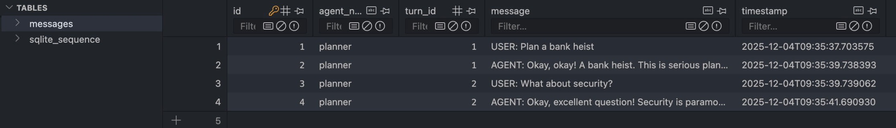

Another day, another cornerstone, another feature. Today I'm thinking about how conversations can survive a restart. This sounds a bit constructed for "How can I use SQLite?".

This is important because, for example, in case of crashes, I need the history. Or if I want to study behavioral patterns in this project.

## SQLite Persistence

To ensure that conversations between agents persist even after a system restart, I use a local SQLite database. The database file is called agent_memory.db and stores all messages.

## The Implementation

The implementation looks as follows.

```python
import sqlite3
from datetime import datetime
from openai import OpenAI

# Setup SQLite
conn = sqlite3.connect("agent_memory.db")
cursor = conn.cursor()

# Create table
cursor.execute("""
CREATE TABLE IF NOT EXISTS messages (
    id INTEGER PRIMARY KEY AUTOINCREMENT,
    agent_name TEXT NOT NULL,
    turn_id INTEGER NOT NULL,
    message TEXT NOT NULL,
    timestamp TEXT NOT NULL
)
""")
conn.commit()
````

What is conn? What is cursor? What do the values behind the variables mean?

Yes.

Exactly.

This part is new for me.

* `conn = sqlite3.connect("agent_memory.db"`)`: conn is the connection object to the SQLite database. It establishes the connection to the file agent_memory.db and enables all operations such as reading, writing, committing, and closing.
* `cursor = conn.cursor()`: The cursor is a control object that executes SQL commands and retrieves results. With cursor.execute(...), you run SQL commands like CREATE TABLE or INSERT. The cursor points to the current position in the result set (the result of a database query, for example with SELECT statements).

Next are the definitions of various methods.

```python
def save_message(agent_name: str, turn_id: int, message: str):
    """Save message to database"""
    cursor.execute(
        "INSERT INTO messages (agent_name, turn_id, message, timestamp) VALUES (?, ?, ?, ?)",
        (agent_name, turn_id, message, datetime.now().isoformat())
    )
    conn.commit()
```

Something new again. Yay! 😃

In `save_message`, the execute method of our control object cursor is called. We pass a few parameters or data that are written to the database:

* `agent_name`: Name of the agent (e.g., "planner")
* `turn_id`: Number of the conversation cycle (e.g., 1, 2, ...)
* `message`: The actual message (e.g., "USER: Plan a bank heist")
* `datetime.now().isoformat()`: The current time as a timestamp
These values are passed to the placeholders `?` in the SQL command and end up as a new row in the messages table.

```python
def get_conversation_history(agent_name: str) -> list:
    """Load conversation from database"""
    cursor.execute(
        "SELECT turn_id, message FROM messages WHERE agent_name = ? ORDER BY turn_id",
        (agent_name,)
    )
    return cursor.fetchall()
```

The `get_conversation_history` method, in turn, loads entries from the database.

* `SELECT turn_id, message` means: Select the columns turn_id and message from the table.
* `FROM messages`: The data is retrieved from the table named messages.
* `WHERE agent_name = ?`: Only the row is selected where the column agent_name matches a specific value.
* The question mark `?` is a placeholder for a value that is inserted later (e.g., in Python code). This protects against SQL injection and makes the query flexible.
* `ORDER BY turn_id`: The results are sorted by the turn_id column (ascending, unless otherwise specified).
* And finally, `fetchall`, which returns all remaining rows of the last executed SQL statement as a list of tuples.

That's it for the database. There would certainly be weeks and months to invest here. Unfortunately, I don't have that time today.

Next comes a method for interacting with the LLM or chatting. At the same time, we save the user message in the database and load the history from the database. We pass the history as context when chatting. The response is again saved in the database.

```python
def agent_chat(agent_name: str, turn_id: int, user_message: str) -> str:
    """Chat with persistence"""
    # Save user message
    save_message(agent_name, turn_id, f"USER: {user_message}")

    # Get history
    history = get_conversation_history(agent_name)
    context = "\n".join([f"Turn {t}: {msg}" for t, msg in history])

    # Generate response
    response = client.chat.completions.create(
        model="google/gemma-3n-e4b",
        messages=[
            {"role": "system", "content": f"You are {agent_name}. Previous conversation:\n{context}"},
            {"role": "user", "content": user_message}
        ],
        max_tokens=100
    )

    agent_response = response.choices[0].message.content

    # Save agent response
    save_message(agent_name, turn_id, f"AGENT: {agent_response}")

    return agent_response
```

We continue with the connection to the locally hosted LLM. This part should be second nature by now.

```python
client = OpenAI(
    base_url="http://localhost:1234/v1",
    api_key="not-needed"
)
```

And then a few more prints to test and visualize everything.

```python
# Test
print("="*60)
print("DAY 4: SQLITE PERSISTENCE")
print("="*60)

agent_name = "planner"

print("\n[Session 1]")
resp1 = agent_chat(agent_name, 1, "Plan a bank heist")
print(f"Response: {resp1[:100]}...")

resp2 = agent_chat(agent_name, 2, "What about security?")
print(f"Response: {resp2[:100]}...")

print("\n[Session 2 - After Restart]")
print("Loading from database...")
history = get_conversation_history(agent_name)
print(f"Found {len(history)} messages in database!")

for turn_id, msg in history:
    print(f"  Turn {turn_id}: {msg[:60]}...")

conn.close()
```

First, I generate a few interactions and write them to the database. Then, of course, I don't actually perform a real restart, but simply load the database. I don't need to restart to simulate this.

Finally, I output all messages:

```bash
============================================================
TAG 4: SQLITE PERSISTENZ
============================================================

[Session 1]
Response: Okay, okay! A bank heist. This is serious planning territory. Let's break this down into a comprehen...
Response: Okay, excellent question! Security is paramount. We need to thoroughly analyze the bank's security m...

[Session 2 - After Restart]
Loading from database...
Found 4 messages in database!
  Turn 1: USER: Plan a bank heist...
  Turn 1: AGENT: Okay, okay! A bank heist. This is serious planning te...
  Turn 2: USER: What about security?...
  Turn 2: AGENT: Okay, excellent question! Security is paramount. We n...
```

You can clearly see that both the user message and the response were stored in our SQL database and successfully reloaded. We can also view the database directly if we have installed the appropriate software or, for example, the SQLite Viewer plugin for VS Code.



## Summary

We have now set up a database. The advantages are obvious. It is persistent and conversations survive restarts, crashes, etc. We can restore the conversation history at any time. We can use the history to analyze agent behavior patterns, for example.

And SQLite wasn't particularly difficult to implement. Of course, this only applies to this simple use case. I'm confident that I'll soon be throwing my hands up in the air when I face the next hurdle 😄
