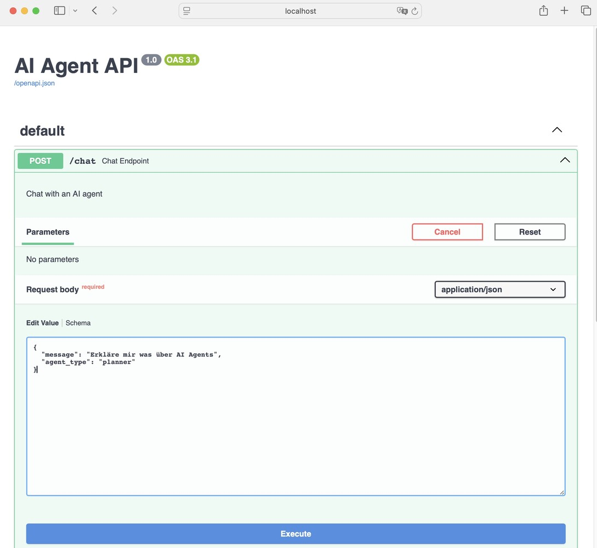
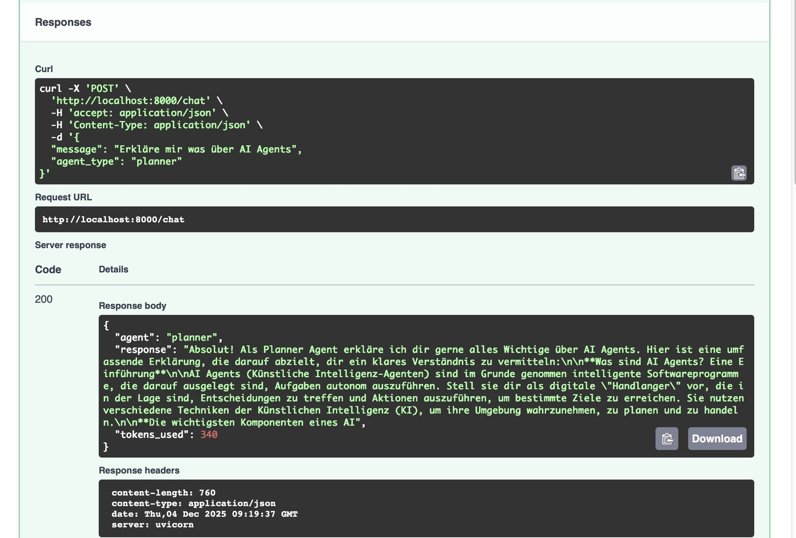

And here’s another fundamental concept for our project: FastAPI. You can find the code [here](https://github.com/gvtsch/aoc_2025_heist/blob/main/day_05/day_05_fastapi.py).

## What is FastAPI?

That’s exactly what I asked myself. Well, almost... I knew what it’s used for, but not exactly how to implement it. Time to learn something new!

FastAPI is a Python framework for building web APIs. It turns our Python code into a web server that can be called via HTTP – kind of like a website, but for program-to-program communication.

This time, I’ll start with the result. If you run the script below, a service is started that you can access via the given IP or localhost.

```bash
============================================================
TAG 5: FASTAPI REST API
============================================================

🚀 Starting API server...
📖 API Docs: http://localhost:8000/docs
🧪 Test: curl -X POST http://localhost:8000/chat -H 'Content-Type: application/json' -d '{"message": "Hello", "agent_type": "planner"}'

INFO:     Started server process [10735]
INFO:     Waiting for application startup.
INFO:     Application startup complete.
INFO:     Uvicorn running on http://0.0.0.0:8000 (Press CTRL+C to quit) @docs/linkedin_code_snippets/day_05_fastapi.py
```

Then this GUI opens in your browser.


If you stick to the given structure in the chat window, you’ll get a response generated by our locally hosted LLM.

### Prompt



### Response



Of course, you can also do this in the terminal. A typical command might look like this

```bash
curl -X POST http://localhost:8000/chat \
  -H 'Content-Type: application/json' \
  -d '{"message": "Hello", "agent_type": "planner"}'
```

This leads to the following output in the terminal:

```bash
{"agent":"planner","response":"Hello there! 👋 \n\nIt's good to hear from you. How can I help you today?  Do you have any questions, or is there something specific you'd like to discuss? \n\nI'm ready for anything! 😊\n\n\n\n","tokens_used":404}% 
```

Kind of funny that it is exactly 404 tokens which have been used. In the first moment I was looking for some error ... 😄

There are many more ways to use this API. For now, just the simplest one. You can build complex APIs, use different endpoints and methods, add authentication and authorization, validate data, generate automated documentation, and so on and so forth...

But now it’s time to do some coding. I won’t show everything here, but you can check out the full code in my [repository](https://github.com/gvtsch/aoc_2025_heist/blob/main/day_05/day_05_fastapi.py).

## Implementation

Let's start with locally hosted LLM first. This time just a little different.

```python
from openai import OpenAI

client = OpenAI(
    base_url="http://localhost:1234/v1",
    api_key="not-needed"
)
```

But unlike before, I’m passing the model name elsewhere today – where I define my endpoint. We’ll run into this later. This gives me the freedom to define different models for different agents.

FastAPI creates a web application with a title and version.

```python
from fastapi import FastAPI

app = FastAPI(title="AI Agent API", version="1.0") 
Pydantic Models help us with structured output and data validation.

from pydantic import BaseModel

class ChatRequest(BaseModel):
    message: str
    agent_type: str = "planner"

class ChatResponse(BaseModel):
    agent: str
    response: str
    tokens_used: int
```

The BaseModel defines the structure of incoming and outgoing data. It automatically validates whether message is a string or tokens_used is an integer, etc.

That’s super handy because I don’t have to worry about data checking – Pydantic takes care of it and ensures clean, safe data. So I can focus on the actual logic.

### HTTP Methods (Endpoints)

Now for the part I hadn’t dared to tackle in the past. Or wasn’t allowed to ...

The HTTP POST endpoint @app.post is used in our case, for example, to send chat messages.

```python
@app.post("/chat", response_model=ChatResponse)
def chat_endpoint(request: ChatRequest):
    """Chat with an AI agent"""

    # Get or create conversation history
    if request.agent_type not in conversations:
        conversations[request.agent_type] = []

    # Add user message
    conversations[request.agent_type].append({
        "role": "user",
        "content": request.message
    })

    # Generate response
    response = client.chat.completions.create(
        model="google/gemma-3n-e4b",
        messages=[
            {"role": "system", "content": f"You are a {request.agent_type} agent."},
            *conversations[request.agent_type]
        ],
        max_tokens=150
    )

    agent_message = response.choices[0].message.content

    # Add to history
    conversations[request.agent_type].append({
        "role": "assistant",
        "content": agent_message
    })

    return ChatResponse(
        agent=request.agent_type,
        response=agent_message,
        tokens_used=response.usage.total_tokens
    )
```

I’m defining a so-called POST endpoint for the API. That means: If someone sends an HTTP POST request to `/chat` (e.g. with curl or from the browser), the chat_endpoint function is executed.

And then it goes step by step:

1. **Input and validation**: The function gets a request object of type ChatRequest. It contains the message (`message`) and the agent type (`agent_type`). FastAPI and Pydantic automatically check if the data is correct.
2. **Manage conversation history**: There’s a dictionary called conversations. For each agent type, the previous conversation is stored there. If there’s no history for the agent yet, a new list is created.
Save user message: The current user message is added to the history as a dictionary (`role: user, content: ...`).
3. **Generate response**: The LLM gets all previous messages (including the system message) and generates a response. The system message tells the model what role to take (e.g. "You are a planner agent"). That’s similar to a persona you might pass in the prompt. The history is passed as a list of messages.
4. **Save agent response**: The agent’s response is also added to the history (`role: assistant, content: ...`).
5. **Return response**: The function returns a ChatResponse object. It contains the agent type, the generated response, and the number of tokens used (useful for costs and limits).

With this endpoint, I can send a message to an AI agent via HTTP POST and get an AI-generated response back. The conversation is saved for each agent type, so the agent "remembers" the previous context.

The GET endpoint `/history/{agent_type}` is the counterpart to the POST endpoint and is used to retrieve the current conversation history of an agent.

```python
@app.get("/history/{agent_type}")
def get_history(agent_type: str):
    """Get conversation history"""
    return {
        "agent": agent_type,
        "messages": conversations.get(agent_type, []),
        "count": len(conversations.get(agent_type, []))
    }
```

I’m defining a GET endpoint for the API. That means, similar to the POST endpoint: If someone sends an HTTP GET request to /history/{agent_type}, the get_history function is executed.

Here’s what happens:

1. **Parameter passing**: The agent type is passed as part of the URL (e.g. `/history/planner`). FastAPI extracts this value and passes it as a string to the function.
2. **Retrieve history**: The function looks up the appropriate agent in the conversations dictionary and returns the saved conversation as a list. If there’s no history, an empty list is returned.
3. **Structure response**: The response is a dictionary with three fields: agent is the name of the agent, messages is the complete conversation history as a list of messages and count the number of messages in the history

With the GET endpoint, I can query the current conversation of an agent at any time and get the complete history as a dictionary – including agent name and message count. This is handy for debugging, frontend display, or just to see what the agent "knows" so far.

Last but not least, the root path. This is also a GET endpoint. The difference here is that you’re directed to the base URL.

```python
def root():
    return {
        "message": "AI Agent API",
        "docs": "/docs",
        "endpoints": {
            "chat": "POST /chat",
            "history": "GET /history/{agent_type}"
        }
    }
```

It’s just a small homepage for the API – here you get an overview of where to find the main endpoints and the docs. Handy for anyone discovering or testing the API.

What's left? `uvicorn`!

```python
uvicorn.run(app, host="0.0.0.0", port=8000)
```

In FastAPI projects like mine, Uvicorn is used as the server to run the application. It starts the web server, receives HTTP requests, and passes them to the FastAPI app. Or in short: Uvicorn takes care of hosting and routing the API endpoints I’ve defined in FastAPI.

We already tested all this at the beginning of the post. So the only question left is: What’s the point of all this?

## Summary

FastAPI is the central interface of my project. It connects all agents, services, and microservices via standardized HTTP endpoints – whether it’s a memory service, simulation, orchestrator, or external tools. This means I can:

* Communicate with the agent or service from any program that can send HTTP requests (frontend, other Python scripts, automation tools).
* Keep the architecture flexible and extensible: New services can be easily integrated, replaced, or scaled.
* Continue developing the logic centrally, without clients having to worry about it.
Use the automatically generated API documentation – development and debugging become super comfortable.
* Run microservices truly decoupled: Each service works independently, but can be orchestrated via the API.

In short: FastAPI connects everything. I can reach my agents and services from anywhere. The API makes the system flexible, extensible, and easy to test. Without FastAPI, the interplay of components would be much more complicated.

Another highlight: FastAPI also supports asynchronous programming with async/await – which makes it especially powerful for handling many simultaneous requests.
