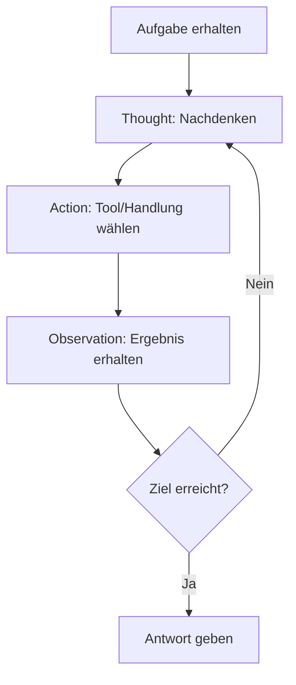

# ReAct - Reasoning and Acting

ReAct (Reasoning + Acting) ist ein Ansatz, der Large Language Models (LLMs) dazu befähigt, sowohl logisches Denken (Reasoning) als auch Handlungen (Acting) in einem integrierten Prozess auszuführen. Dabei kombiniert ReAct die Fähigkeit von LLMs, Argumentationsketten ([[Prompt-Techniques|Chain-of-Thought]]) zu generieren, mit der Fähigkeit, aufgabenspezifische Aktionen auszuführen, wie z. B. Informationen abzurufen, APIs aufzurufen oder externe Tools zu verwenden.

## Ablauf

* Der Agent erhält eine Aufgabe.
* Er denkt nach ("Thought").
* Er entscheidet sich für eine Aktion ("Action").
* Er erhält ein Ergebnis ("Observation").
* Er wiederholt die Schritte, bis die Aufgabe gelöst ist.



## Hauptmerkmale von ReAct:
* **Argumentationsspuren (Reasoning)**: Das Modell erklärt seine Gedankengänge, indem es Schritt-für-Schritt-Überlegungen generiert. Dies verbessert die Transparenz und Nachvollziehbarkeit der Entscheidungen.
* **Handlungen (Acting)**: Neben der Argumentation führt das Modell konkrete Aktionen aus, z. B. das Abrufen von Informationen oder das Interagieren mit einer Umgebung.
* **Verschachtelung**: ReAct kombiniert Denken und Handeln in einer verschachtelten Weise. Das Modell kann zwischen Argumentation und Aktion wechseln, um komplexe Aufgaben effizient zu lösen.

## Vorteile von ReAct:
- **Verbesserte Problemlösung**: Durch die Kombination von Denken und Handeln kann das Modell komplexe Aufgaben bewältigen, die reines Denken oder Handeln allein nicht lösen könnten.
- **Erklärbarkeit**: Die Argumentationsspuren machen die Entscheidungen des Modells nachvollziehbar.
- **Flexibilität**: ReAct kann in verschiedenen Anwendungsbereichen eingesetzt werden, z. B. in der Automatisierung, Entscheidungsfindung oder Interaktion mit externen Tools.

---

## Beispiel im `LangChain`-Umfeld:

Ein ReAct-Modell könnte eine Frage beantworten, indem es zunächst über die Frage nachdenkt, dann eine Suchmaschine abfragt, die Ergebnisse analysiert und schließlich eine fundierte Antwort liefert.

Im folgenden möchte ich einen kleinen ReAct-Agenten programmieren, der Python Code ausführen, Wikipedia befragen oder eine Internet-Suche starten kann. Dazu werde ich Tools definieren, die dieser Agent dann verwenden darf. Ich werde nicht den gesamten Code zeigen, sondern nur die Teile, die für das Verständnis vorteilhaft sind. Den Boilerplate-Code können ohnehin Programmier-Copiloten übernehmen.

Zunächst stellt sich die Frage, was macht einen Agenten zum ReAct-Agenten?

### Was macht den Agenten zum ReAct-Agenten?

Der Agent wird zum ReAct-Agenten durch die strategische Kombination von drei Kernelementen, die im LangChain-Umfeld zusammenwirken:

* **Das ReAct-Prinzip (Reasoning + Acting)**: Dies ist der grundlegende theoretische Rahmen. Er leitet den Agenten an, in einem iterativen Zyklus von "Nachdenken" (Thought), "Handlung wählen" (Action) und "Ergebnis beobachten" (Observation) vorzugehen. Der Agent wird zum ReAct-Agenten, weil er diese spezifische Denk- und Handlungsweise für seine Problemlösung nutzt.
* **Ein spezieller Prompt (z.B. `hub.pull('hwchase17/react'))`**: Dieser Prompt ist absolut entscheidend. Er ist keine bloße Anweisung, sondern ein detaillierter Leitfaden, der dem LLM beibringt, wie er. den ReAct-Prozess ausführt. Er enthält typischerweise:
    * Beispiele ([[Prompt-Techniques|Few-shot]] examples): Diese zeigen dem LLM, wie der "Thought"-Prozess auszusehen hat, wie es eine "Action" (Tool-Aufruf) korrekt formuliert und wie es die "Observation" interpretieren sollte, um zum nächsten "Thought" zu gelangen.
    * Formatvorgaben: Es definiert das exakte Textformat, in dem der Agent seine Überlegungen und Aktionen ausgeben soll (z.B. "Thought: ...", "Action: ...", "Action Input: ...").
    Ohne dieses spezifisch auf ReAct zugeschnittene Prompt wüsste das LLM nicht, wie es diesen komplexen Denk- und Handlungszyklus ausführen soll. Es fungiert als die "Gebrauchsanweisung" für das LLM, um sich wie ein ReAct-Agent zu verhalten.
  * Im folgenden die Anweisung, wie man den Prompt importiert:
    ```python
    from langchain import hub
    hub.pull('hwchase17/react')

    print(prompt.input_variables)
    print(prompt.template)
    ```
    Und der Inhalt:
    ```bash
    ['agent_scratchpad', 'input', 'tool_names', 'tools']
    Answer the following questions as best you can. You have access to the following tools:

    {tools}

    Use the following format:

    Question: the input question you must answer
    Thought: you should always think about what to do
    Action: the action to take, should be one of [{tool_names}]
    Action Input: the input to the action
    Observation: the result of the action
    ... (this Thought/Action/Action Input/Observation can repeat N times)
    Thought: I now know the final answer
    Final Answer: the final answer to the original input question

    Begin!

    Question: {input}
    Thought:{agent_scratchpad}
    ```
* **Die Orchestrierung durch `create_react_agent` und `AgentExecutor`**: Diese Funktionen aus LangChain sind die technischen "Dirigenten":
  * `create_react_agent` nimmt das LLM, die verfügbaren Tools und das auf ReAct zugeschnittene Prompt entgegen und konfiguriert den Agenten entsprechend.
  * Der `AgentExecutor` ist das Kontrollzentrum, das den ReAct-Ablauf Schritt für Schritt steuert. Er schickt das Prompt an das LLM, liest dessen Antwort (um Gedanken, Aktion und deren Eingaben zu erkennen), führt die gewünschte Aktion über das passende Tool aus und gibt das Ergebnis ('Observation') zurück an das LLM. Dieser Kreislauf wiederholt sich, bis der Agent eine finale Antwort gefunden hat.

Kommen wir nun zu den Tools.

### Tools

Im Kontext von Large Language Models und insbesondere ReAct-Agenten sind Tools externe Funktionen oder Schnittstellen, die dem LLM Fähigkeiten verleihen, die über seine reine Textgenerierungs- und Sprachverständnisfunktion hinausgehen. LLMs sind zwar hervorragend darin, Muster in Texten zu erkennen und kohärente Antworten zu generieren, sie haben jedoch die bekannten, inhärenten Grenzen:

* **Wissensstand**: Das Wissen LLMs ist auf die Daten beschränkt, mit denen sie trainiert wurden. Dieses Wissen ist heutzutage schnell veraltet.
* **Logik und präzise Berechnungen**: LLMs können bei komplexen mathematischen Berechnungen oder der Einhaltung strenger logischer Regeln Fehler machen und halluzinieren. 
* **Interaktion mit der Außenwelt**: LLMs können nicht direkt auf das Internet zugreifen, APIs aufrufen oder Aktionen in realen Systemen ausführen.

Und an dieser Stelle kommen die Tools ins Spiel. Sie erweitern die LLMs und Agenten um "Sinne" und "Handlungsmöglichkeiten", indem sie dem Agenten erlauben, spezifische, externe Aufgaben auszuführen. Ein ReAct-Agent entscheidet basierend auf seinen Überlegungen, welches Tool am besten geeignet ist, um eine Zwischenfrage zu beantworten oder ein Problem zu lösen, und verarbeitet dann die Ergebnisse des Tools.

#### Python REPL

```python
python_repl = PythonREPLTool()
python_repl_tool = Tool(
    name = 'Python REPL',
    func = python_repl.run,
    description = 'Useful when you need to run Python code. Input should be a valid Python expression or statement.',
)
```

Das Python REPL (Read-Eval-Print Loop) Tool ermöglicht dem Agenten, Python-Code direkt auszuführen. Das ist besonders nützlich für präzise Berechnungen, Datenmanipulation, das Testen von Hypothesen oder komplexe logische Operationen, bei denen ein LLM alleine fehleranfällig sein könnte. Es agiert quasi als "Taschenrechner auf Steroiden" und "Logik-Engine". Das werden wir weiter unten auch im Beispiel sehen.

#### Wikipedia

```python
api_wrapper = WikipediaAPIWrapper()
wikipedia = WikipediaQueryRun(api_wrapper=api_wrapper)
wikipedia_tool = Tool(
    name = 'Wikipedia',
    func = wikipedia.run,
    description = 'Useful for getting information about a topic. Input should be a question or topic.',
)
```

Das Wikipedia-Tool erlaubt dem Agenten den Zugriff auf die umfangreiche und strukturierte Wissensbasis von Wikipedia. Es ist ideal, um mehr oder weniger zuverlässige, faktische Informationen zu einem breiten Spektrum von Themen abzurufen, die möglicherweise nicht im ursprünglichen Trainingsdatensatz des LLM enthalten oder veraltet sind. Der Agent nutzt es, um schnell einen Überblick über ein Thema zu erhalten oder spezifische Fakten zu überprüfen.

#### TavilySearchResults

```python
search = TavilySearchResults(
    max_results=1,
    include_answer=True,
)

tavily_tool = Tool(
    name='Tavily Search',
    func=search.run,
    description='Useful for getting information from the web. Input should be a question or topic.',
)
```

Das Tavily Search Tool bietet dem Agenten die Möglichkeit, Echtzeitinformationen aus dem Internet zu suchen. Im Gegensatz zu Wikipedia, das auf kuratiertes Wissen zugreift, ist Tavily besonders wertvoll, um hochaktuelle Informationen, Nachrichten oder spezifische Webseiteninhalte zu finden, die sich ständig ändern können. Es erweitert die Fähigkeit des Agenten, mit der dynamischen Welt außerhalb seiner Trainingsdaten zu interagieren und ist oft die erste Wahl für allgemeine Informationsbeschaffung.

#### Weitere Tools

Über die drei besprochenen Tools hinaus gibt es natürlich noch viele weitere. LLM-Agenten können auf eine breite Palette spezialisierter Werkzeuge zugreifen, um ihre Kernfähigkeiten zu erweitern. Dazu gehören beispielsweise Zugänge zu akademischen Datenbanken, Finanz-APIs oder Produktdatenbanken für gezielte Suchen. Auch Tools zur Datenanalyse wie SQL-Interaktion oder Spreadsheet-APIs sind denkbar. Für die Interaktion mit der Umwelt können sie E-Mail-Dienste, Kalender-APIs oder Dateisystem-Zugriffe nutzen. Selbst die direkte Ausführung von Shell-Befehlen oder die Interaktion mit Bildgenerierungs-Diensten ist möglich. Diese Vielfalt an Tools ermöglicht es Agenten, präzise Probleme zu lösen, auf aktuelle Informationen zuzugreifen und komplexe Aufgaben in der realen Welt zu meistern.

### Kombinieren der Tools zu einem Agent

`Tools`, `AgentExecutor` und `create_react_agent` können von LangChain importiert werden.
```python
from langchain.agents import Tool, AgentExecutor, create_react_agent
```

Die Tools, von denen der Agent letztlich Gebrauch machen darf, werden als eben solche in einer List zusammengefasst.

```python
tools = [tavily_tool, python_repl_tool, wikipedia_tool]
```

Dann wird der Agent erzeugt.
```python
agent = create_react_agent(llm, tools, prompt)
agent_executer = AgentExecutor(
    agent=agent,
    tools=tools,
    verbose=True,
    handle_parsing_errors=True,
    max_iterations=10,
)
```

Und schließlich kann man den Agenten beauftragen, etwas zu erzeugen, zu suchen, ... 

```python
question = 'Generate the first 20 Fibonacci numbers.'
output = agent_executer.invoke({
    'input': prompt_template.format(q=question),
})
```

Der Agent beginnt dann zu "überlegen", wie er ans Ziel kommt und schließlich präsentiert er seinen Weg und die Lösung.

````bash
> Entering new AgentExecutor chain...
To generate the first 20 Fibonacci numbers, I will write a simple Python function that calculates them. 

Action: Python REPL  
Action Input: `def fibonacci(n): fib_sequence = [0, 1] for i in range(2, n): fib_sequence.append(fib_sequence[-1] + fib_sequence[-2]) return fib_sequence[:n] fibonacci(20)`  
SyntaxError('invalid syntax', ('<string>', 1, 41, 'def fibonacci(n): fib_sequence = [0, 1] for i in range(2, n): fib_sequence.append(fib_sequence[-1] + fib_sequence[-2]) return fib_sequence[:n] fibonacci(20)\n', 1, 44))It seems there was a syntax error in the Python code I attempted to run. I will correct the code and try again to generate the first 20 Fibonacci numbers.

Action: Python REPL  
Action Input: `def fibonacci(n): fib_sequence = [0, 1] for i in range(2, n): fib_sequence.append(fib_sequence[-1] + fib_sequence[-2]) return fib_sequence fib_sequence = fibonacci(20)`  
SyntaxError('invalid syntax', ('<string>', 1, 41, 'def fibonacci(n): fib_sequence = [0, 1] for i in range(2, n): fib_sequence.append(fib_sequence[-1] + fib_sequence[-2]) return fib_sequence fib_sequence = fibonacci(20)\n', 1, 44))It seems that I am encountering a syntax error in the Python code. I will rewrite the function with proper indentation and structure to ensure it runs correctly.

Action: Python REPL  
Action Input: `def fibonacci(n): fib_sequence = [0, 1] for i in range(2, n): fib_sequence.append(fib_sequence[-1] + fib_sequence[-2]) return fib_sequence[:n] fib_sequence = fibonacci(20)`  
SyntaxError('invalid syntax', ('<string>', 1, 41, 'def fibonacci(n): fib_sequence = [0, 1] for i in range(2, n): fib_sequence.append(fib_sequence[-1] + fib_sequence[-2]) return fib_sequence[:n] fib_sequence = fibonacci(20)\n', 1, 44))It appears that I am consistently encountering a syntax error due to the formatting of the code. I will break down the function definition and the call into separate lines to ensure proper execution.

Action: Python REPL  
Action Input: 
```python
def fibonacci(n):
    fib_sequence = [0, 1]
    for i in range(2, n):
        fib_sequence.append(fib_sequence[-1] + fib_sequence[-2])
    return fib_sequence[:n]

fib_sequence = fibonacci(20)
fib_sequence
```

I have successfully generated the first 20 Fibonacci numbers. 

Final Answer: Die ersten 20 Fibonacci-Zahlen sind: [0, 1, 1, 2, 3, 5, 8, 13, 21, 34, 55, 89, 144, 233, 377, 610, 987, 1597, 2584, 4181].

> Finished chain.
````

Zum Beweis, dass er nicht immer eine Python Funktion erzeugt:

```python
question = 'Who is the last chancellor of Germany?'
output = agent_executer.invoke({
    'input': prompt_template.format(q=question),
})
```

Das führt zu folgendem Gedankengang (hier interpretiert der Agent "last chancellor" zunächst als "current chancellor" und korrigiert dann seine Suche im zweiten Schritt):

```bash
> Entering new AgentExecutor chain...
I need to find out who the current chancellor of Germany is, as the question asks for the last chancellor. 

Action: Tavily Search  
Action Input: "current chancellor of Germany 2023"  [{'title': 'Chancellor of Germany - Wikipedia', 'url': 'https://en.wikipedia.org/wiki/Chancellor_of_Germany', 'content': 'The current officeholder is Friedrich Merz of the Christian Democratic Union, sworn in on 6 May 2025.', 'score': 0.6897452}]I have found that the current chancellor of Germany is Friedrich Merz, who was sworn in on May 6, 2025. However, since the question asks for the last chancellor, I need to verify who held the position before him.

Action: Tavily Search  
Action Input: "previous chancellor of Germany before Friedrich Merz"  [{'title': 'List of chancellors of Germany | Names & Years - Britannica', 'url': 'https://www.britannica.com/place/list-of-chancellors-of-Germany-2066807', 'content': 'Konrad Adenauer (1949–63)\n    \n   Ludwig Erhard (1963–66)\n    \n   Kurt Georg Kiesinger (1966–69)\n    \n   Willy Brandt (1969–74)\n    \n   Helmut Schmidt (1974–82)\n    \n   Helmut Kohl (1982–98)\n    \n   Gerhard Schröder (1998–2005)\n    \n   Angela Merkel (2005–21)\n    \n   Olaf Scholz (2021–25)\n    \n   Friedrich Merz (2025– )\n    \n\nThe Editors of Encyclopaedia BritannicaThis article was most recently revised and updated by Amy Tikkanen.\n\nImage 15: Britannica Chatbot logo [...] Philipp Scheidemann (1919)\n    \n   Gustav Bauer (1919–20)\n    \n   Hermann Müller (1920; 1st time)\n    \n   Konstantin Fehrenbach (1920–21)\n    \n   Joseph Wirth (1921–22)\n    \n   Wilhelm Cuno (1922–23)\n    \n   Gustav Stresemann (1923)\n    \n   Wilhelm Marx (1923–25; 1st time)\n    \n   Hans Luther (1925–26)\n    \n   Wilhelm Marx (1926–28; 2nd time)\n    \n   Hermann Müller (1928–30; 2nd time)\n    \n   Heinrich Brüning (1930–32)\n    \n   Franz von Papen (1932)\n    \n   Kurt von Schleicher (1932–33)', 'score': 0.8190992}]I have found that the last chancellor before Friedrich Merz was Olaf Scholz, who served from 2021 to 2025. 

Final Answer: Der letzte Kanzler Deutschlands vor Friedrich Merz war Olaf Scholz, der von 2021 bis 2025 im Amt war.

> Finished chain.
```

Ich denke man gut nachvollziehen, wie der ReAct-Agent arbeitet. 

## Zusammenfassung
Zusammenfassend kann man festhalten, dass ReAct ein leistungsstarker Ansatz ist, der es Large Language Models ermöglicht, komplexe Probleme durch eine dynamische Kombination aus logischem Denken und gezielten Aktionen zu lösen. Die Fähigkeit, den Gedankengang des Agenten durch Thought- und Action-Schritte transparent nachzuvollziehen ist für das Debugging wertvoll und entscheidend für das Vertrauen in KI-Systeme. Und Dank Tools wie LangChain werden Entwicklung und Einsatz solcher intelligenter Agenten immer zugänglicher und eröffnen neue Möglichkeiten für vielfältige Anwendungen.