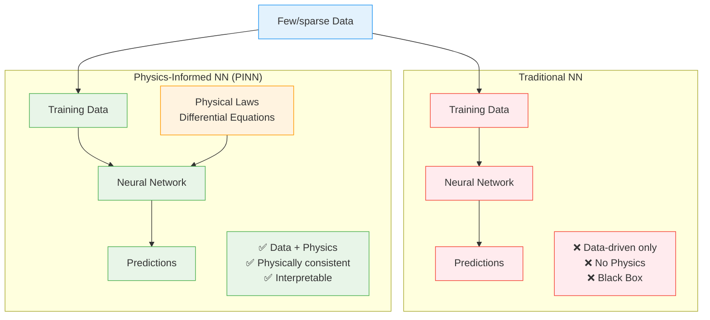

# Physics-Informed Neural Networks (PINN)

While traditional Neural Networks (NNs) are powerful, they sometimes reach their limits when dealing with complex physical systems. They often don't integrate physical prior knowledge, which can lead to inconsistent or intransparent predictions. After all, they remain black boxes.

One way to address this problem is through Physics-Informed Neural Networks (PINNs). They integrate fundamental physical principles and laws (often differential equations) into their learning process.

Essentially, you combine the flexibility of Neural Networks with physical laws.

--- 

## What are PINNs?

PINNs learn by embedding physical laws into their loss function. The Neural Network not only minimizes the error with respect to observational data, but is additionally penalized if the neural network's predictions violate physical laws.

> A simple example: In a closed, simple system, when temperature increases, pressure should also rise. If it doesn't, the prediction seems to violate the physical law. This violation is accounted for in the training process within the loss function.

What makes PINNs practical in the first place is **Automatic Differentiation (AD)**. Many physical laws are differential equations - they contain derivatives like velocity (first derivative of position) or acceleration (second derivative).

Previously, it was often extremely tedious to calculate these derivatives manually. With AD, modern Deep Learning frameworks like `TensorFlow` or `PyTorch` can calculate these derivatives automatically and exactly. The neural network learns, for example, a position $x(t)$, and AD automatically calculates $dx/dt$ (velocity) and $d^{2}x/dt^{2}$ (acceleration) - exactly what's needed for physical equations.

Physical laws also serve as a "constraint" that guides learning and the training process toward physically consistent solutions. This ultimately leads to more efficient, robust learning and better generalization capability on unseen scenarios.

This also means that a PINN can be trained with smaller, sparse, incomplete datasets because physics provides strong prior knowledge, while traditional NNs often require massive amounts of high-quality data.

**The difference from traditional NNs:** Traditional neural networks are "black boxes" - they deliver results, but no one can explain how they arrive at these predictions. PINNs, on the other hand, are somewhat transparen: their predictions must necessarily follow the physical laws that we explicitly built into the training. This makes them not only more interpretable, but also significantly more trustworthy for critical applications.



---

## Advantages of PINNs over Standard NNs

PINNs offer several advantages over traditional neural networks.

First, there's the improved accuracy and interpretability. They deliver more accurate and reliable predictions, especially for complex, nonlinear systems, such as when describing turbulence. The results are physically plausible, which is important for safety and reliability.

Another point is data efficiency and robustness. PINNs reduce the need for large, clean datasets and can effectively learn from sparse or noisy data.

Speed, scalability, and efficiency are also important factors. After training, PINNs deliver very fast results for real-time inferences and optimization problems. They also reduce computational load compared to purely numerical methods.

PINNs are also excellent at inverse problems. The goal is to derive unknown parameters, conditions, or causes from observed data, such as material properties or boundary conditions. This distinguishes them from forward problems, which focus on predicting outcomes.

But PINNs can do more than just solve problems. They can discover partial differential equations in a data-driven manner and even uncover the underlying mathematical expressions of a system through symbolic regression. This makes AI a real tool for scientific discoveries, technical design optimization, and precise causal analysis.

Enough theory, let's move to the practical example.

---

## Practical Example: Spring-Mass-Damper System

To illustrate how a PINN works, let's consider modeling a spring-mass-damper system. This system is described by an ordinary differential equation (ODE) that represents the motion of a mass under spring force and damping:

$$m \cdot \frac{d^2x}{dt^2} + c \cdot \frac{dx}{dt} + k \cdot x = 0$$

Our PINN will learn to approximate the displacement $x(t)$ over time $t$ by integrating this ODE directly into its loss function.

### The PINN Loss Function

Unlike traditional neural networks, the loss function of a physics-informed neural network is somewhat more complex. In our example, it essentially consists of three parts:

1.  **Physics Loss:** This part measures how well the model satisfies the underlying differential equation (ODE) at the collocation points.
2.  **Position Data Loss:** Here we check how well the model matches the known position data.
3.  **Velocity Data Loss:** This term compares the velocity calculated by the model with the actually available data.

More on the weights later. At this point, it's important to understand that this special loss function exists.

### Implementation

We start again with the imports, which are really quite limited this time.

```python
import tensorflow as tf
import numpy as np
import matplotlib.pyplot as plt
from typing import Dict, Any, Tuple
```

And then I define the system parameters.

```python
class SystemParameters:
    def __init__(self, m: float = 1.0, c: float = 0.5, k: float = 10.0):
        self.mass = m  # Mass
        self.damping = c  # Damping coefficient
        self.stiffness = k # Spring constant
``` 

### `DataOnlyModel`

Next comes the `DataOnlyModel` class. It represents a purely data-based approach to modeling physical systems. It serves as a direct comparison partner to the PINN and shows what happens when you try to learn complex dynamics exclusively from a few data points.

```python
class DataOnlyModel(tf.keras.Model):
    def __init__(self):
        super().__init__()
        self.dense1 = tf.keras.layers.Dense(64, activation='tanh', name='dense_1')
        self.dense2 = tf.keras.layers.Dense(64, activation='tanh', name='dense_2')
        self.output_layer = tf.keras.layers.Dense(1, name='output_layer')
        
        self.total_loss_tracker = tf.keras.metrics.Mean(name="total_loss")
        self.data_pos_loss_tracker = tf.keras.metrics.Mean(name="data_pos_loss")
        self.data_vel_loss_tracker = tf.keras.metrics.Mean(name="data_vel_loss")

    def call(self, t: tf.Tensor) -> tf.Tensor:
        return self.output_layer(self.dense2(self.dense1(t)))

    @tf.function
    def data_loss_position(self, t_data: tf.Tensor, x_data: tf.Tensor) -> tf.Tensor:
        x_pred = self(t_data)
        return tf.reduce_mean(tf.square(x_pred - x_data))

    @tf.function
    def data_loss_velocity(self, t_data_vel: tf.Tensor, v_data_vel: tf.Tensor) -> tf.Tensor:
        with tf.GradientTape() as tape:
            tape.watch(t_data_vel)
            x_pred = self(t_data_vel)
        dx_dt_pred = tape.gradient(x_pred, t_data_vel)
        return tf.reduce_mean(tf.square(dx_dt_pred - v_data_vel))

    def train_step(self, data: Tuple[tf.Tensor, tf.Tensor]) -> Dict[str, tf.Tensor]:
        all_inputs_as_one_element, _ = data
        t_data_pos, x_data_pos, t_data_vel, v_data_vel = all_inputs_as_one_element
        
        with tf.GradientTape() as tape:
            loss_d_pos = self.data_loss_position(t_data_pos, x_data_pos)
            loss_d_vel = self.data_loss_velocity(t_data_vel, v_data_vel)
            total_loss = loss_d_pos + loss_d_vel

        gradients = tape.gradient(total_loss, self.trainable_variables)
        self.optimizer.apply_gradients(zip(gradients, self.trainable_variables))

        self.total_loss_tracker.update_state(total_loss)
        self.data_pos_loss_tracker.update_state(loss_d_pos)
        self.data_vel_loss_tracker.update_state(loss_d_vel)
        
        return {
            "total_loss": self.total_loss_tracker.result(),
            "data_pos_loss": self.data_pos_loss_tracker.result(),
            "data_vel_loss": self.data_vel_loss_tracker.result()
        }
    
    @property
    def metrics(self):
        return [self.total_loss_tracker, self.data_pos_loss_tracker, self.data_vel_loss_tracker]
```

#### Model Architecture

The model uses the same neural network architecture as the upcoming PINN: Two Dense layers with $64$ neurons each and `tanh` activation, followed by a linear output layer. This deliberate agreement eliminates architecture-related differences and ensures that any performance differences are solely due to the learning approach.

The network takes a time point $t$ as input and should predict the position $x(t)$ - exactly like the PINN.

The difference from the PINN lies in the loss function. The `DataOnlyModel` knows no physical laws and learns exclusively from the available data points:

* **Position Data Loss**: Standard Mean Squared Error between predicted and actual position
* **Velocity Data Loss**: This is where it gets interesting - the model calculates the derivative of its output using `tf.GradientTape` and compares it with the given velocity data

The `DataOnlyModel` has no idea that its predictions must satisfy the spring-mass-damper equation $m \cdot \frac{d^2x}{dt^2} + c \cdot \frac{dx}{dt} + k \cdot x = 0$. It only knows the few given data points and tries to interpolate a function from them.

#### `@tf.function` - Performance Optimization

The `@tf.function` decorators in our loss functions are essential for performance. This decorator converts Python functions into optimized `TensorFlow` graphs.

Without `@tf.function`, every single operation would be interpreted in Python, which would be slow and inefficient. With `@tf.function`, however, `TensorFlow` compiles the function into a static computational graph on first call and optimizes it. All subsequent calls are then significantly faster.

This is particularly important for our `DataOnlyModel` because the `data_loss_velocity` function calculates derivatives with `tf.GradientTape`. This is computationally intensive, and these functions are called in every single training step, thousands of times. Graph optimization significantly accelerates the gradient calculations.

In practice, this means the first training step is somewhat slower because `TensorFlow` has to compile the function first. But all subsequent steps then run much faster. And with $5000$ epochs, that makes an enormous difference!

I can already reveal that the performance gain with the upcoming PINN is even more dramatic because we have even more complex, nested gradient calculations for the second derivatives there.

#### `tf.GradientTape` - Automatic Differentiation

The `tf.GradientTape` is essentially TensorFlow's tool for automatic differentiation (AD). It records all operations while they're being executed and can then calculate derivatives.

You might wonder why our `DataOnlyModel` needs this at all. Let's look at the code:

```python
with tf.GradientTape() as tape:
    tape.watch(t_data_vel)        # "Watch" the time variable
    x_pred = self(t_data_vel)     # Calculate position
dx_dt_pred = tape.gradient(x_pred, t_data_vel)  # Derive velocity
```

The reason is as follows: Our data-based model only learns the position `x(t)`. But we also have velocity data that we want to use for training. To calculate the velocity from the position, we need the derivative `dx/dt`. And that's exactly what `GradientTape` does for us, it calculates it automatically.

Without `GradientTape`, we would have to approximate the derivative manually, for example through finite differences. But that would be inaccurate and quite tedious. With `GradientTape`, we get the exact derivative automatically, which is perfect for our velocity loss.

#### Custom Training Step (`train_step`)

The core of this model lies in its custom `train_step` implementation, which enables it to learn from different types of supervision data.

The `train_step` expects a tuple of four input tensors:
* `t_initial_pos`, `x_initial_pos`: Time points and associated positions for the initial position information.
* `t_initial_vel`, `v_initial_vel`: Time points and associated velocities for the initial velocity information.

The total loss function (`total_loss`) consists of two components, both calculated as Mean Squared Error (MSE):
* **Position Data Loss (`loss_data_pos`)**: Here the direct output of the model (`self(t_initial_pos)`) is compared with the actual (`x_initial_pos`) position values. This is a standard regression loss.
* **Velocity Data Loss (`loss_data_vel`)**: This is actually the more interesting part. To obtain the velocity, the derivative of the model output with respect to time (`dxdt_at_t_initial_vel`) is calculated. This happens with the help of `tf.GradientTape`, where `t_initial_vel` is explicitly "watched" so that the derivative with respect to this input can be tracked. The calculated gradient (for example the slope of the position function learned by the model) is then compared with the actual velocity (`v_initial_vel`).

After the `total_loss` is calculated, the `tf.GradientTape` uses the recorded operations to calculate the gradients of the total loss with respect to all trainable parameters of the network (`self.trainable_variables`). These gradients are then used by the optimizer (`self.optimizer.apply_gradients`) to adjust the network weights and minimize the loss.

The `train_step` then returns a dictionary with the individual loss components and the total loss, which is useful for monitoring training progress.

Overall, this model is a purely data-driven model that attempts to learn an unknown physical relationship (position as a function of time) by integrating both direct position measurements and information about the rate of position change (velocity) into its loss function. It differs from classical Physics-Informed Neural Networks (PINNs) in that it doesn't use an explicit differential equation as a physical restriction in the loss term, but merely uses the derivative of the output for velocity comparison.

### `PINNModel`

```python
class PINNModel(tf.keras.Model):
    def __init__(self, system_params: SystemParameters, pinn_weights: Dict[str, float]):
        super().__init__()
        self.system_params = system_params
        self.pinn_weights = pinn_weights
        self.dense1 = tf.keras.layers.Dense(64, activation='tanh', name='dense_1')
        self.dense2 = tf.keras.layers.Dense(64, activation='tanh', name='dense_2')
        self.output_layer = tf.keras.layers.Dense(1, name='output_layer')
        
        self.total_loss_tracker = tf.keras.metrics.Mean(name="total_loss")
        self.physics_loss_tracker = tf.keras.metrics.Mean(name="physics_loss")
        self.data_pos_loss_tracker = tf.keras.metrics.Mean(name="data_pos_loss")
        self.data_vel_loss_tracker = tf.keras.metrics.Mean(name="data_vel_loss")

    def call(self, t: tf.Tensor) -> tf.Tensor:
        return self.output_layer(self.dense2(self.dense1(t)))

    @tf.function
    def physics_loss(self, t_collocation: tf.Tensor) -> tf.Tensor:
        with tf.GradientTape(persistent=True) as tape:
            tape.watch(t_collocation)
            x = self(t_collocation) 
            dx_dt = tape.gradient(x, t_collocation)
            d2x_dt2 = tape.gradient(dx_dt, t_collocation)
        
        ode_residual = self.system_params.mass * d2x_dt2 + self.system_params.damping * dx_dt + self.system_params.stiffness * x
        return tf.reduce_mean(tf.square(ode_residual))

    @tf.function
    def data_loss_position(self, t_data: tf.Tensor, x_data: tf.Tensor) -> tf.Tensor:
        x_pred = self(t_data)
        return tf.reduce_mean(tf.square(x_pred - x_data))

    @tf.function
    def data_loss_velocity(self, t_data_vel: tf.Tensor, v_data_vel: tf.Tensor) -> tf.Tensor:
        with tf.GradientTape() as tape:
            tape.watch(t_data_vel)
            x_pred = self(t_data_vel)
        dx_dt_pred = tape.gradient(x_pred, t_data_vel)
        return tf.reduce_mean(tf.square(dx_dt_pred - v_data_vel))

    def train_step(self, data: Tuple[tf.Tensor, tf.Tensor]) -> Dict[str, tf.Tensor]:
        all_inputs_as_one_element, _ = data
        t_collocation, t_data_pos, x_data_pos, t_data_vel, v_data_vel = all_inputs_as_one_element

        with tf.GradientTape() as tape:
            loss_p = self.physics_loss(t_collocation)
            loss_d_pos = self.data_loss_position(t_data_pos, x_data_pos)
            loss_d_vel = self.data_loss_velocity(t_data_vel, v_data_vel)
            
            total_loss = (self.pinn_weights.get('w_p', 1.0) * loss_p +
                          self.pinn_weights.get('w_d_pos', 1.0) * loss_d_pos +
                          self.pinn_weights.get('w_d_vel', 1.0) * loss_d_vel)

        gradients = tape.gradient(total_loss, self.trainable_variables)
        self.optimizer.apply_gradients(zip(gradients, self.trainable_variables))

        self.total_loss_tracker.update_state(total_loss)
        self.physics_loss_tracker.update_state(loss_p)
        self.data_pos_loss_tracker.update_state(loss_d_pos)
        self.data_vel_loss_tracker.update_state(loss_d_vel)
        
        return {
            "total_loss": self.total_loss_tracker.result(),
            "physics_loss": self.physics_loss_tracker.result(),
            "data_pos_loss": self.data_pos_loss_tracker.result(),
            "data_vel_loss": self.data_vel_loss_tracker.result()
        }

    @property
    def metrics(self):
        return [self.total_loss_tracker, self.physics_loss_tracker,
                self.data_pos_loss_tracker, self.data_vel_loss_tracker]
``` 

#### Model Architecture (PINNModel)

The neural network I use here is structurally identical to my `DataOnlyModel`. It consists of two Dense layers with `tanh` activation and a single linear output layer. Here too, the network should approximate the position `x` as a function of time `t`.

Unlike the previous model, however, additional system parameters (`mass`, `damping`, `stiffness`) are passed here. These `system_params` are fixed values from real physics that describe the system we want to model, a mass-spring-damper system.

The already mentioned `pinn_weights` are also important for PINNs. These weights control how important the different loss components are in training.
 
#### Custom Training Step (train_step)

The `train_step` is somewhat more complex here because it considers three different types of "errors" (or losses).

First, there's the **Data Input**: Besides the known data points for the initial position (`t_initial_pos`, `x_initial_pos`) and initial velocity (`t_initial_vel`, `v_initial_vel`), a new type is added here: the so-called **collocation points** (`t_collocation`). These are time points we randomly choose to check whether our model satisfies the physical laws.

> Collocation points are strategically selected points in the domain of the differential equation where the neural network must satisfy the physical laws.
>
> Unlike traditional numerical methods that work on a fixed grid, collocation points can be flexibly distributed. They enable enforcing physical laws continuously over the entire domain. The more collocation points used, the more strictly physical consistency is monitored.
> 
> There are different strategies for distributing collocation points:
>
> *   **Uniform distribution**: This is the simplest approach and works well for smooth solutions.
> *   **Adaptive distribution**: Here more points are placed in areas with high curvature or gradients.
> *   **Random distribution**: Can be advantageous for complex geometries.
>
> In our spring-mass-damper example, we will use $200$ uniformly distributed collocation points over the time range $0$ to $5$ seconds. At each of these points, the PINN must satisfy the equation $m \cdot \frac{d^2x}{dt^2} + c \cdot \frac{dx}{dt} + k \cdot x = 0$.

Then there are the **Derivatives (`tf.GradientTape(persistent=True)`)**: `persistent=True` allows using the same tape for multiple gradient calculations. This is important because we need not only the first derivative (for example, velocity) but also the second derivative (acceleration) of the model output with respect to time. All input times (`t_collocation`, `t_initial_pos`) are "watched" with `tape.watch()` so we can calculate their derivatives.

And finally, the **Loss through physical laws (`ode_loss`)**: The model predicts the position at the collocation points (`x_pred_collocation`). Then the first derivative (`dxdt_collocation`, the velocity predicted by the model) and the second derivative (`d2xdt2_collocation`, the predicted acceleration) are calculated with respect to time `t_collocation`. These derivatives are then substituted into the physical equation, in our example into the equation for a damped oscillation: $m \cdot \frac{d^2x}{dt^2} + c \cdot \frac{dx}{dt} + k \cdot x = 0$. The `ode_loss` then measures how much the left side of this equation deviates from zero. If the model learns the physics perfectly, this loss should ideally be zero.

The **Loss through position data (`loss_data_pos`)** works identically to the `DataOnlyModel`. Here we directly compare the position predicted by the model with the real position data. The same applies to the **Loss through velocity data (`loss_data_vel`)**: Here too we compare the velocity derived by the model with the real velocity data, as in the `DataOnlyModel`.

The **Total loss (`total_loss`)** is then a weighted sum of all these three loss components. The `pinn_weights` (`w_p`, `w_d_pos`, `w_d_vel`) determine how much the model should focus on satisfying physics, matching position data, and matching velocity data. These weights are important for the stability and convergence of PINNs.

> One of the critical aspects of PINNs is the balance between different loss components. In our example, I use the following weights:
> 
> ```python
> pinn_weights = {
>     'w_p': 10.0,      # Physics loss 
>     'w_d_pos': 1.0,   # Position data loss
>     'w_d_vel': 5.0    # Velocity data loss
> }
> ```
> 
> I weight the physics (`w_p`) quite highly at $10.0$ so that the model strictly follows the physical laws. The velocity weight (`w_d_vel`) at $5.0$ is weighted more strongly than position because velocity information is important for dynamics. For the position weight (`w_d_pos`), I chose a base weighting of $1.0$ for the initial position.
> 
> Wrong weighting can quickly lead to problems: For example, physically inconsistent solutions if `w_p` is too low, or poor data fitting if `w_p` is too high. And in the worst case, it can lead to unstable training if the ratios are unbalanced.
> 
> The optimal weighting is often problem-specific and requires considerable experimental fine-tuning. I defined the above distribution through trial and error.

Finally, as usual, the gradients of the `total_loss` with respect to the trainable parameters of the network are calculated and used to update the model weights.

### Analytical Solution

The `analytical_solution` function serves to calculate the exact position of a damped harmonic oscillator at a specific time point `t`, considering arbitrary initial conditions.

```python
def analytical_solution(t: np.ndarray, params: SystemParameters) -> np.ndarray:
    zeta = params.damping / (2 * np.sqrt(params.mass * params.stiffness)) 
    omega_n = np.sqrt(params.stiffness / params.mass)  
    
    x0 = 0.0
    v0 = 1.0
    
    if abs(zeta - 1.0) < 1e-6:
        C1 = x0
        C2 = v0 + omega_n * x0
        return (C1 + C2 * t) * np.exp(-omega_n * t)
        
    elif zeta < 1:
        omega_d = omega_n * np.sqrt(1 - zeta**2)
        C1 = x0
        C2 = (v0 + zeta * omega_n * x0) / omega_d
        return np.exp(-zeta * omega_n * t) * (C1 * np.cos(omega_d * t) + C2 * np.sin(omega_d * t))
        
    else:
        discriminant = np.sqrt(zeta**2 - 1)
        alpha1 = omega_n * (-zeta + discriminant)
        alpha2 = omega_n * (-zeta - discriminant)
        
        A2 = (v0 - alpha1 * x0) / (alpha2 - alpha1)
        A1 = x0 - A2
        return A1 * np.exp(alpha1 * t) + A2 * np.exp(alpha2 * t)
``` 

Let's look at the input parameters more closely:

*   **`t`**: This is the time point for which we want to calculate the position.
*   **`system_params`**: Through this we pass the mass (`m`), damping (`c`) and stiffness (`k`) of the system.
*   **`x0`**: The initial position of the oscillator at time `t=0`.
*   **`v0`**: The initial velocity of the oscillator at time `t=0`.

In the first step, we calculate the undamped natural frequency (`omega_n`$=\omega_n$) and the damping ratio (`zeta`$=\zeta$). The damping ratio is important to determine which of the three damping cases applies.

The core logic consists of a case distinction depending on which damping case applies. It's important that the constants in the respective solution formulas are dynamically calculated from the passed `x0` and `v0` values.

*   **Critically damped case ($\zeta$ is close to $1.0$)**:
    *   The constants $C_1$ and $C_2$ are directly derived from $x_0$ and $v_0$.
    *   The position is calculated with the formula $x(t) = (C_1 + C_2 t) e^{-\omega_n t}$.
*   **Underdamped case ($\zeta < 1.0$)**:
    *   The damped natural frequency $\omega_d$ is calculated.
    *   The constants $C_1$ and $C_2$ (which now determine the amplitude and phase of the oscillation) are derived from $x_0$ and $v_0$.
    *   The position is calculated with the formula $x(t) = e^{-\zeta \omega_n t}(C_1 \cos(\omega_d t) + C_2 \sin(\omega_d t))$.
*   **Overdamped case ($\zeta > 1.0$)**:
    *   The two characteristic roots $\alpha_1$ and $\alpha_2$ of the solution are calculated.
    *   The constants $A_1$ and $A_2$ are determined by solving a linear system of equations given by $x_0$ and $v_0$.
    *   The position is calculated with the formula $x(t) = A_1 e^{\alpha_1 t} + A_2 e^{\alpha_2 t}$.

The function then returns the calculated position $x$ of the oscillator at time $t$, which correctly reflects the specific initial conditions $x0$ and $v0$.

In the context of Machine Learning and Physics-informed neural networks, this extended function serves as "ground truth" or reference solution. The greater flexibility allows us to evaluate the performance of neural networks (especially the PINN model) under a broader range of initial conditions. This is important to ensure the robustness and generalization capability of the PINN.

### `CustomProgressLogger`

This Keras callback serves to log and output the training progress. I can specify with the `log_interval` how often a corresponding message should be output.

```python
class CustomProgressLogger(tf.keras.callbacks.Callback):
    def __init__(self, log_interval: int = 1000):
        super().__init__()
        self.log_interval = log_interval

    def on_epoch_end(self, epoch: int, logs: Dict[str, Any] = None):
        if logs is None:
            logs = {}
        if epoch % self.log_interval == 0 or epoch == self.params['epochs'] - 1:
            total_loss = logs.get('total_loss', 'N/A')
            physics_loss = logs.get('physics_loss', 'N/A')
            data_pos_loss = logs.get('data_pos_loss', 'N/A')
            data_vel_loss = logs.get('data_vel_loss', 'N/A')
            
            if 'physics_loss' in logs:
                print(f"Epoch {epoch:05d}: Total Loss: {total_loss:.4e}, "
                      f"Physics Loss: {physics_loss:.4e}, "
                      f"Pos Data Loss: {data_pos_loss:.4e}, "
                      f"Vel Data Loss: {data_vel_loss:.4e}")
            else: 
                print(f"Epoch {epoch:05d}: Total Loss: {total_loss:.4e}, "
                      f"Pos Data Loss: {data_pos_loss:.4e}, "
                      f"Vel Data Loss: {data_vel_loss:.4e}")
``` 

The output always occurs at the end of an epoch, specifically when the epoch number is a multiple of the specified `log_interval` or when the last epoch of training is reached.

Regarding the display, the various loss values are logged: the total loss, the physics loss, and the data loss for position and velocity.

The output is formatted to adapt depending on whether it's a PINN model that has a physics loss, or a purely data-based model.

In short: It's an adaptable progress logger that specifically informs me about the most important loss values during Keras training.

### `prepare_data` Function

This function serves to prepare all time points and initial values we need for training our models and later plotting the results.

```python
def prepare_data(config: Dict[str, Any]) -> Dict[str, tf.Tensor]:
    t_initial_pos = tf.constant([[0.0]], dtype=tf.float32)
    x_initial_pos = tf.constant([[0.0]], dtype=tf.float32)  
    t_initial_vel = tf.constant([[0.0]], dtype=tf.float32)
    v_initial_vel = tf.constant([[1.0]], dtype=tf.float32)  

    t_collocation_pinn = tf.constant(
        np.linspace(0, config['plot_time_range'][1], config['num_collocation_points'])[:, None], 
        dtype=tf.float32
    )

    t_plot_np = np.linspace(*config['plot_time_range'])[:, None]
    t_plot_tf = tf.constant(t_plot_np, dtype=tf.float32)

    return {
        't_initial_pos': t_initial_pos, 'x_initial_pos': x_initial_pos,
        't_initial_vel': t_initial_vel, 'v_initial_vel': v_initial_vel,
        't_collocation_pinn': t_collocation_pinn,
        't_plot_np': t_plot_np, 't_plot_tf': t_plot_tf
    }
``` 

I create `TensorFlow` tensors for the initial position `x(0)=0` and initial velocity `dtdx(0)=1`. Additionally, I generate a series of uniformly distributed time points (`t_collocation_pinn`) that the PINN model uses to "check" the physical equations.

For visualizing the results, I create both `NumPy` arrays and `TensorFlow` tensors for the time axis, which will later be used to generate predictions.

The function then returns a dictionary with all these prepared tensors and `NumPy` arrays. It collects and formats all necessary input data (initial values, time points for training and plotting) in a central step.

### `train_model` 

This function serves to train any Keras model. I compile the passed `model` with the Adam optimizer and the specified `learning_rate`.

```python
def train_model(
    model: tf.keras.Model, 
    dataset: tf.data.Dataset, 
    epochs: int, 
    learning_rate: float, 
    early_stopping_config: Dict[str, Any],
    log_interval: int,
    model_name: str
) -> tf.keras.callbacks.History:

    print(f"\n--- Training {model_name} Model ---")
    model.compile(optimizer=tf.keras.optimizers.Adam(learning_rate=learning_rate))

    callbacks = []

    if model_name == "PINN" and early_stopping_config:
        early_stopping_callback = tf.keras.callbacks.EarlyStopping(
            monitor=early_stopping_config['monitor'],
            patience=early_stopping_config['patience'],
            min_delta=early_stopping_config['min_delta'],
            mode=early_stopping_config['mode'],
            verbose=early_stopping_config['verbose'],
            restore_best_weights=True
        )
        callbacks.append(early_stopping_callback)

    progress_logger = CustomProgressLogger(log_interval=log_interval)
    progress_logger.params = {'epochs': epochs}
    callbacks.append(progress_logger)

    history = model.fit(
        dataset,
        steps_per_epoch=1, 
        epochs=epochs,
        callbacks=callbacks,
        verbose=0 
    )
    print(f"\n{model_name} Training finished after {len(history.history['total_loss'])} epochs.")
    return history
```

Additionally, I add a few callbacks:
*   An **EarlyStopping** callback only exists if it's the "PINN" model and the configuration for it is available. This callback ensures that training is stopped early if the loss no longer improves.
*   I always add the `CustomProgressLogger`. It regularly outputs training progress.

Then I call the model's `fit` method to start training with the provided `dataset` and defined `callbacks`. I suppress the standard Keras output (`verbose=0`) since the `CustomProgressLogger` handles the output.

After training completion, it returns the `history` object. This object contains information about the training progress (for example loss values per epoch).

The function encapsulates the entire training process for a Keras model. This includes compilation, applying callbacks, and the actual `fit` operation. In the end, it returns the training history.

### `plot_results` Function

The function visualizes the results by plotting the predictions of both trained models (PINN and data-based) against the known analytical solution and the original training data.

```python
def plot_results(
    t_plot_np: np.ndarray, 
    x_pred_pinn: np.ndarray, 
    x_pred_data_only: np.ndarray, 
    x_analytical: np.ndarray,
    initial_data: Dict[str, tf.Tensor],
    config: Dict[str, Any]
):

    plt.figure(figsize=(12, 7))
    plt.plot(t_plot_np, x_analytical, 'k--', linewidth=2, label='Analytical Solution')
    
    pinn_label = (f'PINN (w_p={config["pinn_weights"]["w_p"]}, '
                  f'w_d_pos={config["pinn_weights"]["w_d_pos"]}, '
                  f'w_d_vel={config["pinn_weights"]["w_d_vel"]})')
    plt.plot(t_plot_np, x_pred_pinn, 'b-', linewidth=1.5, label=pinn_label)
    plt.plot(t_plot_np, x_pred_data_only, 'r:', linewidth=1.5, label='Pure Data-based NN Prediction')
    
    plt.plot(initial_data['t_initial_pos'].numpy(), initial_data['x_initial_pos'].numpy(), 
             'go', markersize=8, label='Training Data (x(0))')
    plt.plot(initial_data['t_initial_vel'].numpy(), initial_data['v_initial_vel'].numpy() * 0, 
             'rx', markersize=8, label='Training Data (dx/dt(0))') 

    plt.xlabel('Time (t)', fontsize=12)
    plt.ylabel('Displacement (x)', fontsize=12)
    plt.title('Comparison: Spring-Mass-Damper System (PINN vs. Pure Data-based)', fontsize=14)
    plt.legend(fontsize=10)
    plt.grid(True)
    plt.tight_layout()
    plt.show()
```

The `plot_results` function creates a comparison plot that unites all important elements at a glance.

The main purpose is a visual comparison of all three approaches - analytical, PINN, and purely data-based - in a clear plot. This way you can directly see how well the models perform compared to the exact solution and to each other.

### `main` Function

```python
def main():
    config: Dict[str, Any] = {
        'epochs_pinn': 50_000, 
        'epochs_data_only': 5_000,
        'learning_rate': 0.001,
        'pinn_weights': {'w_p': 10.0, 'w_d_pos': 1.0, 'w_d_vel': 5.0},
        'num_collocation_points': 200,
        'plot_time_range': (0, 5, 200), 
        'early_stopping': {
            'monitor': 'total_loss', 
            'patience': 1000,       
            'min_delta': 5e-4,      
            'mode': 'min',          
            'verbose': 1            
        },
        'log_interval': 1000 
    }
    
    system_params = SystemParameters()
    data_tensors = prepare_data(config)

    pinn_model = PINNModel(system_params, config['pinn_weights'])
    pinn_dataset = tf.data.Dataset.from_tensors(
        ((data_tensors['t_collocation_pinn'], data_tensors['t_initial_pos'], data_tensors['x_initial_pos'], 
          data_tensors['t_initial_vel'], data_tensors['v_initial_vel']), 
         tf.constant([0.0], dtype=tf.float32)) 
    ).repeat() 

    history_pinn = train_model(
        pinn_model, 
        pinn_dataset, 
        config['epochs_pinn'], 
        config['learning_rate'], 
        config['early_stopping'],
        config['log_interval'],
        "PINN"
    )

    data_only_model = DataOnlyModel()
    data_only_dataset = tf.data.Dataset.from_tensors(
        ((data_tensors['t_initial_pos'], data_tensors['x_initial_pos'], 
          data_tensors['t_initial_vel'], data_tensors['v_initial_vel']),
         tf.constant([0.0], dtype=tf.float32)) 
    ).repeat()

    history_data_only = train_model(
        data_only_model, 
        data_only_dataset, 
        config['epochs_data_only'], 
        config['learning_rate'], 
        {},
        config['log_interval'],
        "Data-Only NN"
    )

    x_pred_pinn = pinn_model(data_tensors['t_plot_tf']).numpy()
    x_pred_data_only = data_only_model(data_tensors['t_plot_tf']).numpy()
    x_analytical = analytical_solution(data_tensors['t_plot_np'], system_params)

    plot_results(
        data_tensors['t_plot_np'], 
        x_pred_pinn, 
        x_pred_data_only, 
        x_analytical,
        data_tensors,
        config
    )

    print("\nComparison training and plot completed.")
```

The `main` function is the core of the program, it controls the entire workflow. Essentially, you configure all important parameters for training and visualization here. This includes things like the number of epochs, learning rate, various weights, and the range in which the results should be plotted.

First, the physical parameters of the system are initialized, namely mass, damping, and stiffness. Then I call `prepare_data`. This function creates all TensorFlow tensors that will later be needed for training and plotting.

Next comes the exciting part: training the two models.

*   **PINN Training:** First I initialize the `PINNModel`. Then I create the appropriate `tf.data.Dataset` and call `train_model` to train the PINN. Early stopping is also activated here to prevent overfitting.
*   **Data-based NN Training:** Then I initialize the `DataOnlyModel` and create the corresponding `tf.data.Dataset`. Here too, `train_model` is called to train the purely data-based NN.

After training, I generate predictions with the trained models for the entire plot time range. Additionally, I calculate the analytical solution to have a comparison.

Finally, the results are plotted. The `plot_results` function displays the results graphically so you can directly compare PINN, data-based NN, and the analytical solution.

When everything has run through, there's a final message signaling that all steps have been completed successfully.

### Training and Results

But now it's time to train the models. So I run the script and first get these outputs. An interpretation follows in the next section.

First, the training progress of the PINN.

```bash
--- Training PINN Model ---
Epoch 00000: Total Loss: 1.1973e+02, Physics Loss: 1.1230e+01, Pos Data Loss: 0.0000e+00, Vel Data Loss: 1.4862e+00
Epoch 01000: Total Loss: 2.6340e+00, Physics Loss: 1.0341e-01, Pos Data Loss: 9.6072e-03, Vel Data Loss: 3.1806e-01
[...]
Epoch 39000: Total Loss: 1.6668e-01, Physics Loss: 1.6599e-02, Pos Data Loss: 9.7122e-05, Vel Data Loss: 1.1815e-04
Epoch 39791: early stopping
Restoring model weights from the end of the best epoch: 38791.

PINN Training finished after 39791 epochs.
```

And then the training progress of the data-based NN.

```bash
--- Training Data-Only NN Model ---
Epoch 00000: Total Loss: 2.1020e+00, Pos Data Loss: 0.0000e+00, Vel Data Loss: 2.1020e+00
Epoch 01000: Total Loss: 0.0000e+00, Pos Data Loss: 0.0000e+00, Vel Data Loss: 0.0000e+00
Epoch 02000: Total Loss: 0.0000e+00, Pos Data Loss: 0.0000e+00, Vel Data Loss: 0.0000e+00
Epoch 03000: Total Loss: 0.0000e+00, Pos Data Loss: 0.0000e+00, Vel Data Loss: 0.0000e+00
Epoch 04000: Total Loss: 0.0000e+00, Pos Data Loss: 0.0000e+00, Vel Data Loss: 0.0000e+00
Epoch 04999: Total Loss: 0.0000e+00, Pos Data Loss: 0.0000e+00, Vel Data Loss: 0.0000e+00

Data-Only NN Training finished after 5000 epochs.
```

And finally, the plot generated by the function that compares the curves.


#### The Direct Comparison

In the above plot, several curves are displayed, which I'll briefly discuss.

**Analytical Solution** (black dashed): The expected perfectly damped sinusoidal oscillation.

**PINN** (blue solid): Follows the analytical solution almost perfectly over the entire time range, even though it receives the same sparse initial data. The physical loss function forces the model to find a solution that satisfies the underlying dynamics of the spring-mass-damper system at every time point.
> I deliberately changed a few parameters so that the results no longer perfectly match the analytical solution. This way you can better see all curves.

**Data-based NN** (red dotted): Learns only from the two extremely sparse initial conditions. Without knowledge of the physical differential equation, it cannot extrapolate the complex oscillatory motion. Its prediction quickly drifts into physically nonsensical regions after the few known points.

#### The "Zero Losses" of the Data-based Model

A particularly insightful aspect of the training results is that the data-based model delivers "zero losses" from epoch $1000$:

```bash
Epoch 01000: Total Loss: 0.0000e+00, Pos Data Loss: 0.0000e+00, Vel Data Loss: 0.0000e+00
```

Zero losses don't mean the model is perfect, but that it has memorized the few training data points (we only had two initial conditions). The model is heavily overfitted and cannot generalize.

This happens because we have too few data points relative to model complexity. The network can simply perfectly memorize the sparse data. And without regularization or additional constraints (like physics in the PINN), wildly fluctuating predictions emerge between data points.

In contrast, the PINN: It shows stable, non-zero losses, which is a good sign. The physics loss acts here as natural regularization and prevents overfitting through continuous physical constraints at the collocation points.

In machine learning with sparse data, zero losses are often a sign of problems, not success. PINNs solve this problem elegantly by integrating domain knowledge.

#### Why the PINN is Superior

The PINN "knows" the physical equation of the system. Even with minimal data, it's forced by the physical loss function to find a solution that obeys the laws of physics. The data-based model, on the other hand, "invents" a function that hits the starting points but has no idea about the underlying dynamics.

**Robustness with sparse data**: The PINN delivers physically plausible predictions even when only few data points are available.

**Physical consistency**: Predictions remain correct and trustworthy even outside the training data. This is important for real applications where data is often incomplete.

The low but stable physics loss shows that the PINN "understands" the physics. This makes it a robust and trustworthy tool for scientific and technical applications.

--- 

## Limitations and Challenges of PINNs

Despite their impressive capabilities, PINNs also have some limitations that should be considered in practical applications:

### Computational Cost and Training Time

**PINNs are significantly slower to train than standard NNs.** This is due to the more complex loss function. Several factors play a role here: First, second-order derivatives must be calculated through automatic differentiation. Second, physical equations must be evaluated at hundreds of collocation points. And finally, multiple backpropagation is needed for different loss components.

In our example, the PINN needed about $40,000$ epochs, while the data-based NN "converged" after just a few thousand epochs - even though the solution it found was wrong.

### Hyperparameter Tuning:

**The weighting parameters often require extensive experimentation.** In our case:

```python
pinn_weights = {
    'w_p': 10.0,  
    'w_d_pos': 1.0,  
    'w_d_vel': 5.0  
}
```

**Wrong weights** can lead to various problems: If weights for physical boundary conditions are set too low, you get physically inconsistent solutions. If they're too high, training data is ignored. And unbalanced ratios quickly lead to unstable training.

The optimal ratio is highly problem-specific and requires systematic experimentation.

### Complex Partial Differential Equations (PDE): Scalability Limits

**For very complex physical systems, PINNs can reach their limits.** Let's look at concrete examples:

**Navier-Stokes equations for three-dimensional flows with turbulence:**
$$\frac{\partial \mathbf{u}}{\partial t} + (\mathbf{u} \cdot \nabla)\mathbf{u} = -\frac{1}{\rho}\nabla p + \nu \nabla^2 \mathbf{u}$$
$$\nabla \cdot \mathbf{u} = 0$$

Here you have **four coupled variables** $u(x,y,z,t)$, $v(x,y,z,t)$, $w(x,y,z,t)$, $p(x,y,z,t)$ with **nonlinear terms** like $(\mathbf{u} \cdot \nabla)\mathbf{u}$. In turbulence, chaotic, multi-scale structures emerge that are extremely difficult to learn.

**Coupled multiphysics problems (fluid-structure interaction):**
$$\rho_s \frac{\partial^2 d}{\partial t^2} = \nabla \cdot \sigma + f \quad \text{(Structure equation)}$$
$$\rho_f \frac{\partial u}{\partial t} + (u \cdot \nabla)u = -\nabla p + \mu \nabla^2 u \quad \text{(Flow equation)}$$
$$u|_\Gamma = \frac{\partial d}{\partial t}\bigg|_\Gamma \quad \text{(Coupling condition)}$$

The PINN would have to **simultaneously learn two different physical domains** and correctly model their **interaction at the interface** $\Gamma$.

**Systems with sharp gradients (shock waves):**
$$\frac{\partial u}{\partial t} + \frac{\partial f(u)}{\partial x} = 0$$

In shock waves, **discontinuities** arise, the solution "jumps" or "steps" abruptly. Standard NNs and thus also PINNs have difficulties with such non-smooth solutions.

In such cases, traditional numerical methods with specialized discretization (finite volumes for shocks, adaptive grids for multi-scale problems) can indeed be superior.

But PINNs don't have to stop at simple examples like our spring-mass-damper system. The fundamental concepts we've learned - the physical loss function, collocation points, and automatic differentiation - can be extended to significantly more complex and powerful applications.

---

## Advanced PINN Concepts

### Multi-Output PINNs: Coupled Systems

Our spring-mass-damper example modeled only **one variable** (position $x$). Real physical systems, however, often have **multiple coupled dependent variables** that must be solved simultaneously.

Let's take 2D heat conduction with coupled heat flow as an example:

$$\frac{\partial T}{\partial t} = \alpha \nabla^2 T \quad \text{(Heat conduction equation)}$$
$$\mathbf{q} = -k \nabla T \quad \text{(Fourier's law)}$$

**The problem:** The PINN must simultaneously learn the **temperature distribution** $T(x,y,t)$ and the **heat flow** $\mathbf{q}(x,y,t)$. And the difficult part is that both quantities are coupled through Fourier's law - heat flow depends directly on the temperature gradient.

**The PINN solution looks like this:** The network has multiple outputs and learns all variables simultaneously. The physics loss function contains **both physical equations** as constraints. This ensures that:

*   Temperature follows the heat conduction equation.
*   Heat flow is correctly calculated from the temperature gradient.
*   Both quantities remain physically consistent.

This is complex because we have **three coupled PDEs** that must be satisfied simultaneously. We also need **partial derivatives** in all spatial directions ($\frac{\partial}{\partial x}$, $\frac{\partial}{\partial y}$, $\frac{\partial}{\partial t}$). And of course, **consistency between variables** must be ensured.

However, the **advantages** are clear: physical couplings are automatically taken into account, and we obtain a consistent solution for all variables simultaneously. This is, of course, more efficient than creating separate models for each variable.

But even with multi-output PINNs, an important question remains: Where exactly should the collocation points be placed? In our spring-mass-damper example, we used 200 uniformly distributed points. While this was simple, it wasn't necessarily the best strategy.

### Adaptive Collocation Points: Intelligent Point Distribution

One way to further improve PINN performance is adaptive point distribution. There are different strategies here:

*   **Error-based:** More points where physics loss is particularly high. This seems logical at first.
*   **Gradient-based:** Denser point distribution in areas with steep gradients.
*   **Residual-based:** Focus on areas where the underlying physical equation is poorly satisfied.
*   **Multi-fidelity:** A combination of coarse and fine resolutions. You could first calculate a coarse solution and then increase resolution in certain areas.

The advantages of such adaptive collocation are obvious: Better convergence with fewer total points, automatic focus on "difficult" areas, and ultimately reduced computation time with improved accuracy.

These advanced concepts show the potential of PINNs for complex, real applications. They demonstrate how PINNs go beyond simple single-variable problems and become a powerful tool for modern scientific modeling.

---

## Summary

In this article, we've thoroughly examined Physics-Informed Neural Networks (PINNs), from theoretical foundations to practical implementation.

We've worked through the core concepts and understood how PINNs combine the flexibility of Neural Networks with physical laws. We've seen that automatic differentiation makes complex derivative calculations practical in the first place. We've also looked at how collocation points enforce physical consistency over the entire domain and how a multi-component loss function balances data fitting with physical constraints.

Subsequently, I showed a complete `TensorFlow` implementation for a spring-mass-damper system and conducted a direct comparison between a PINN and a purely data-based NN with identical, sparse data. It turned out that tuning the weighting parameters is a critical success factor and that performance optimizations through `@tf.function` and `tf.GradientTape` are possible.

From the experiments, we gained some important insights: "Zero losses" with sparse data are a warning sign, not success. PINNs generalize robustly even outside training data, and physical constraints act as natural regularization. However, increased computational cost is the price paid for physical consistency.

Of course, there are also limitations and further potential. There are scalability limits with complex PDEs (for example Navier-Stokes), and hyperparameter sensitivity requires systematic experimentation. Advanced concepts like multi-output PINNs and adaptive collocation points are also promising.

In summary, PINNs are a powerful tool for scientific ML applications, especially valuable with sparse data and physical constraints. They successfully bridge the gap between data-driven ML and physical understanding - an important step toward trustworthy AI in critical applications.

This article provides both the theoretical understanding and practical implementation skills needed to get started with PINNs.