Alle Dokumente zu diesem Beitrag sind in meinem [repository](https://github.com/gvtsch/aoc_2025_heist/tree/main/day_17) zu finden.

Tag 17 eliminiert das letzte Hardcoding im System. Bisher wissen Agents beim Start exakt welche Tools sie haben. Das stand in `agents_config.yaml`: `tools: ["calculator:use"]`. Das ist statisch und unveränderbar zur Laufzeit. 

## Das Problem

Stell dir vor, du startest einen neuen Tool-Service während das System läuft. Beispielsweise ein neuer `weather_forecast` Service, der online geht. Die Agents wissen nichts davon. Sie kennen nur die Tools die beim Start konfiguriert waren. Um das neue Tool nutzen zu können, müssten wir nun: 

1. Die Config-Datei ändern
2. Alle Agents neu starten
3. Die Session unterbrechen
4. Hoffen dass nichts durcheinander kommt

Oder anders... Du willst experimentieren und zum Beispiel verschiedene Tool-Kombinationen A/B-testen. Mit hardcoded Tool-Listen musst du jedes Mal die Config ändern, Agents neu starten und eine neue Session initialisieren. Klingt nicht besonders flexibel 😉 Und deswegen führen wir nun noch tool Discovery ein.

## Tool Discovery

Agents sollten zur Laufzeit erfragen können, **welche Tools es gibt**. Basierend auf ihren OAuth Scopes bekommen sie eine gefilterte Liste zurück. Dynamisch, zur Runtime und ohne Restart.

Das ist das, was das **Model Context Protocol (MCP)** standardisiert. Das haben wir bereits in Tag zwölf für den Memory Service verwendet. An Tag zwölf ging es um Memory-Operationen (`store_memory`, `get_compressed_memory`). Heute erweitern wir MCP für Tool Discovery und die Agents entdecken automatisch welche Tools verfügbar sind. Zumindest ist das der Plan.

## MCP für Tool Discovery

Wir haben MCP, Anthropics Standard für einheitliche LLM-Tool-Schnittstellen, kennengelernt. Statt dass jeder Service seine eigene API erfindet, definiert MCP klare Strukturen. Für Tool Discovery bedeutet das, dass ein Tool nicht nur ein Funktionsname ist, sondern ein vollständiges Interface mit Metadaten:

```json
{
  "name": "calculator",
  "endpoint": "/tools/calculator",
  "scopes": ["calculator:use"],
  "description": "Perform mathematical calculations",
  "parameters": {
    "expression": {
      "type": "string",
      "description": "Math expression to evaluate"
    }
  },
  "returns": "Calculation result"
}
```

Für jedes Tool haben wir:
- **name**: Eindeutiger Identifier
- **endpoint**: Wo das Tool zu erreichen ist
- **scopes**: Welche OAuth Permissions benötigt werden
- **description**: Was macht das Tool?
- **parameters**: Welche Parameter akzeptiert es?
- **returns**: Was gibt es zurück?

Das ist alles was ein Agent braucht um ein Tool zu verstehen und zu nutzen, ohne vorher fest verdrahtet worden zu sein.

## Tool Discovery Server

Der Discovery Server ist das zentrale Tool-Registry. Alle verfügbaren Tools werden dort registriert. Agents fragen den Server: "Was kann ich nutzen?"

### Die Tool Registry

```python
from fastapi import FastAPI
from pydantic import BaseModel
from typing import List, Dict, Any

class ToolDefinition(BaseModel):
    name: str
    endpoint: str
    scopes: List[str]
    description: str
    parameters: Dict[str, Any]
    returns: str
    host: str = "localhost"
    port: int = 8002

# Central Tool Registry
TOOL_REGISTRY: List[ToolDefinition] = [
    ToolDefinition(
        name="calculator",
        endpoint="/tools/calculator",
        scopes=["calculator:use"],
        description="Perform mathematical calculations",
        parameters={
            "expression": {
                "type": "string",
                "description": "Math expression to evaluate"
            }
        },
        returns="Calculation result"
    ),
    # ... weitere Tools
]
```

Die Registry ist eine globale Liste, die alle Tools an einem Ort vereint. Das macht das Management einfach, denn man sieht sofort was verfügbar ist.

### Der Discovery Endpoint

Der wichtigste Endpoint ist GET `/`. Hier fragen Agents nach Tools:

```python
@app.get("/")
async def discover_tools(auth_info: Dict = Depends(decode_token)):
    # Wenn kein Auth: Alle Tools zurückgeben (für Discovery)
    if not auth_info["authenticated"]:
        return {
            "service": "Tool Discovery Server (MCP)",
            "protocol": "MCP",
            "tools": TOOL_REGISTRY
        }

    # Mit Auth: Nach Scopes filtern
    agent_scopes = set(auth_info["scopes"])
    available_tools = [
        tool for tool in TOOL_REGISTRY
        if any(scope in agent_scopes for scope in tool.scopes)
    ]

    return {
        "service": "Tool Discovery Server (MCP)",
        "protocol": "MCP",
        "tools": available_tools
    }
```

**Wichtig:** Die Discovery-Antwort hängt vom OAuth Token ab:

- **Ohne Token**: Alle Tools sichtbar (für Discovery-Zwecke)
- **Mit Token**: Nur Tools mit passenden Scopes (gefiltert)

Das ermöglicht Tool-Exploration ohne Authentication. ABER: Die Tools selbst sind OAuth-geschützt. Nur weil ein Agent ein Tool in der Discovery-Liste sieht, kann er es noch nicht nutzen. Der tatsächliche Tool-Aufruf wird am Tool-Service selbst durch OAuth-Scopes validiert.

## Dynamic Tool Agent

Beim `DynamicToolAgent` handelt es sich um einen Agenten, der Tools dynamisch entdeckt statt sie hart einprogrammiert zu haben.

```python
class DynamicToolAgent:
    def __init__(self, name: str, oauth_token: str, discovery_url: str):
        self.name = name
        self.oauth_token = oauth_token
        self.discovery_url = discovery_url
        self.available_tools = []

        # Discover tools beim Start
        self._discover_tools()

    def _discover_tools(self):
        """Discover available tools from discovery server."""
        headers = {"Authorization": f"Bearer {self.oauth_token}"}

        response = requests.get(self.discovery_url, headers=headers)

        if response.status_code == 200:
            data = response.json()
            self.available_tools = [
                DiscoveredTool(**tool_data)
                for tool_data in data["tools"]
            ]

            print(f"[{self.name}] Discovered {len(self.available_tools)} tools:")
            for tool in self.available_tools:
                print(f"  - {tool.name}: {tool.description}")
```

Bisher bekam der Agent eine Tool-Liste beim Initialisieren. Ab heute bekommt er eine URL unter der der Discovery Server zu finden ist, die **discovery_url**, und sein **OAuth Token**, um Zugriffe zu definieren und zu erhalten.

Beim Start macht er einen HTTP Request zum Discovery Server. Die Antwort definiert welche Tools er nutzen kann. Das passiert zur **Laufzeit**, nicht zur Build-Time.

### Tool Discovery Flow

Visualisiert in einem Sequenzdiagramm sieht der Ablauf wie folgt aus:

```mermaid
sequenceDiagram
    participant Agent as DynamicToolAgent
    participant Discovery as Discovery Server
    participant OAuth as OAuth Service
    participant Tool as Tool Service

    Note over Agent: Agent startet mit<br/>OAuth Scopes:<br/>["calculator:use", "file_reader:use"]

    Agent->>Discovery: GET / (mit OAuth Token)
    Discovery->>Discovery: Token dekodieren<br/>Scopes extrahieren
    Discovery->>Discovery: Tools filtern:<br/>calculator ✓<br/>file_reader ✓<br/>database_query ✗
    Discovery-->>Agent: [calculator, file_reader]

    Note over Agent: Tools entdeckt!<br/>self.available_tools gesetzt

    Agent->>Tool: POST /tools/calculator<br/>(mit OAuth Token)
    Tool->>Tool: OAuth validieren
    Tool-->>Agent: Calculation result
```



Der Agent kennt zur Build-Time **nicht** welche Tools existieren. Er lernt es zur Runtime durch Discovery.

## Integration mit Day 16

Wir können unseren Code von gestern um den Tool Discovery Teil ergänzen, indem wir den `IntegratedAgent` anpassen:

```python
class DiscoveryIntegratedAgent:
    def __init__(
        self,
        config: AgentConfig,
        llm_client: OpenAI,
        oauth_client: OAuthClient,
        memory_client: MemoryServiceClient,
        db_manager: DatabaseManager,
        discovery_url: str,  # ← NEU!
        session_id: str
    ):
        # ... Day 16 Setup ...

        # OAuth Token holen (wie Day 16)
        self.oauth_token = oauth_client.get_token(
            config.name,
            config.oauth_scopes
        )

        # Dynamic Tool Discovery (NEU!)
        self.tool_agent = DynamicToolAgent(
            name=config.name,
            oauth_token=self.oauth_token,
            discovery_url=discovery_url
        )
```

Der `DiscoveryIntegratedAgent` macht alles was der Agent von Tag 16 macht (OAuth, Memory Service und SQLite), sowie eben nun auch Tool Discovery.

**Zur Architektur:** Der `DynamicToolAgent` wird als **Komponente** verwendet. Der `DiscoveryIntegratedAgent` bekommt einen `DynamicToolAgent` als Teil seiner Struktur (`self.tool_agent`). Jede Komponente hat ihre klare Verantwortung: Der `DynamicToolAgent` kümmert sich nur um Tool Discovery und Tracking, der `DiscoveryIntegratedAgent` orchestriert alles zusammen.

### LLM Context mit Tools

Schauen wir uns an wie der `DiscoveryIntegratedAgent` auf Messages antwortet. Die `respond()` Methode bringt alles zusammen: LLM, Memory, Database und die entdeckten Tools:

```python
class DiscoveryIntegratedAgent:
    def respond(self, context: List[Dict[str, str]], turn_id: int) -> str:
        # LLM Messages bauen (wie Tag 16)
        messages = [{"role": "system", "content": self.config.system_prompt}]

        # NEU: Tool Context hinzufügen
        if self.tool_agent.available_tools:
            tool_context = self.tool_agent.generate_tool_prompt_context()
            messages.append({
                "role": "system",
                "content": f"\n{tool_context}"
            })

        # Conversation Context (wie Tag 16)
        for msg in context:
            messages.append({"role": "user", "content": f"[{msg['agent']}]: {msg['message']}"})

        # LLM Response, Memory Store, DB Store (wie Tag 16)
        # ...
```

Die entdeckten Tools fließen direkt in den LLM Prompt ein. Die Methode `generate_tool_prompt_context()` erstellt einen String wie:

```
Available tools:
- calculator(expression): Perform mathematical calculations
- file_reader(filename): Read building blueprints and documents
```

Das LLM sieht welche Tools verfügbar sind und kann sie in seiner Planung berücksichtigen.

## Warum ist Tool Discovery so wertvoll?

Tool Discovery eröffnet völlig neue Möglichkeiten:

### 1. Hot-Swapping von Tools

Du kannst zur Laufzeit neue Tools registrieren:

```python
POST http://localhost:8006/tools/register
{
  "name": "weather_forecast",
  "endpoint": "/tools/weather",
  "scopes": ["weather:read"],
  "description": "Get weather data"
}
```

Agents die `rediscover_tools()` aufrufen sehen das neue Tool sofort, ohne einen Restart durchgeführt zu haben.

### 2. A/B Testing von Tool-Sets

Wir können zwei Discovery Server mit verschiedenen Tool-Sets starten. Die Agents zeigen dann auf verschiedene URLs und man kann testen, welche Tool-Kombination besser performen.

```python
# Team A: Standard Tools
discovery_url_a = "http://localhost:8006"

# Team B: Experimentelle Tools
discovery_url_b = "http://localhost:8007"
```

Beide Teams laufen parallel, nutzen verschiedene Tools und schreiben in verschiedene Sessions. Morgen schauen wir uns dann an, wie wir das analysieren können.

### 3. Permission Updates ohne Restart

Wir können OAuth Scopes zur Laufzeit ändern und so die Zugriffsrechte auch zur Laufzeit ändern.

```python
# Agent bekommt neue Permission
new_token = oauth_client.get_token(
    agent_name,
    scopes=["calculator:use", "database:read"]  # database neu!
)

# Agent rediscovered Tools
agent.tool_agent.oauth_token = new_token
agent.tool_agent.rediscover_tools()

# Agent sieht jetzt database_query Tool
```

### 4. Zentrale Tool Governance

Ein oft unterschätzter Vorteil ist außerdem, dass alle Tools an einem Ort definiert sind. Die zentrale Registry gibt uns einen vollständigen Überblick über unser Tool-Ökosystem. Es gibt keine versteckten Tool-Definitionen in verschiedenen Config-Dateien oder Code-Repositories.

Statt durch Code zu graben oder YAML-Files zu durchsuchen, können wir einfach den Service befragen.

```bash
GET http://localhost:8006/stats
```

Die Antwort zeigt uns dann das komplette Tool-Inventar:

```json
{
  "total_tools": 4,
  "tools_by_name": ["calculator", "file_reader", "database_query", "simulation_data"],
  "scope_usage": {
    "calculator:use": 1,
    "file_reader:use": 1,
    "database:read": 1,
    "simulation:read": 1
  },
  "unique_scopes": 4
}
```

Auf den ersten Blick erhält man folgende Informationen:
- **Welche Tools existieren?** Alle vier Tools sind aufgelistet.
- **Welche Scopes werden benötigt?** Die `scope_usage` Map zeigt welche Permissions vergeben sind.
- **Wie viele Tools nutzen denselben Scope?** Die Zahl zeigt wie oft jeder Scope vorkommt
- **Ist die Tool-Landschaft übersichtlich?** 4 Tools mit 4 unterschiedlichen Scopes

Statt Excel-Sheets mit Tool-Inventaren zu pflegen, ist die Registry die Single Source of Truth. Sie ist immer aktuell, weil sie die laufende Realität widerspiegelt, nicht eine Dokumentation die veralten kann.

Die Tool Discovery müssen wir nun nur noch in unser bestehendes System einbinden.

## Enhanced Orchestrator

Der `OrchestratorWithDiscovery` erweitert Day 16 um Tool Discovery:

```python
class OrchestratorWithDiscovery:
    def __init__(self, config_path: str, discovery_url: str = "http://localhost:8006"):
        # ... Day 16 Setup (Database, OAuth, Memory) ...

        # Create agents with tool discovery
        self.agents = {}
        for agent_config in self.config.agents:
            agent = DiscoveryIntegratedAgent(
                agent_config,
                self.llm_client,
                self.oauth_client,
                self.memory_client,
                self.db_manager,
                discovery_url,  # ← NEU!
                self.session_id
            )
            self.agents[agent_config.name] = agent
```

Der Orchestrator ist fast identisch zu Day 16, mit einem Unterschied: Statt `IntegratedAgent` verwenden wir `DiscoveryIntegratedAgent`.
Die `discovery_url` macht aus einem statischen System ein dynamisches.

Diese Vereinfachung auf Orchestrator-Ebene setzt sich in der Konfiguration fort:

## Config-Änderungen

Die `agents_config.yaml` wird sogar simpler:

**Vorher (Day 16):**
```yaml
agents:
  - name: "safecracker"
    role: "Safe Specialist"
    tools: ["calculator:use"]  # <- Hardcoded
    oauth_scopes: ["calculator:use"]
```

**Nachher (Day 17):**
```yaml
agents:
  - name: "safecracker"
    role: "Safe Specialist"
    # tools removed - dynamisch entdeckt
    oauth_scopes: ["calculator:use"]
```

Die `tools` Liste fällt weg und wir müssen nur noch `oauth_scopes` definieren. Die tatsächlichen Tools kommen wie beschrieben vom Discovery Server.
Das führt zu weniger Redundanz, weniger Fehlerquellen und mehr Flexibilität.

Neben der Discovery bietet der `DynamicToolAgent` noch eine weitere praktische Funktion...

## Tool Usage Tracking

Der `DynamicToolAgent` trackt Tool-Usage automatisch.

```python
def use_tool(self, tool_name: str, **kwargs):
    tool = self.get_tool(tool_name)

    # ... Tool execution ...

    # Track usage
    self.tool_usage_count[tool_name] += 1

    return result
```

Später kann man dann abfragen, wie häufig welches Tool genutzte wurde.

```python
stats = agent.get_tool_usage_stats()

# Output:
{
  "agent": "safecracker",
  "total_tools_available": 2,
  "total_tool_calls": 15,
  "usage_by_tool": {
    "calculator": 12,
    "file_reader": 3
  },
  "most_used_tool": "calculator"
}
```

Das ergänzt den Audit Trail von gestern. Wir loggen nicht nur, was passiert ist, sondern auch welche Tools wie oft genutzt wurden.

Auch am Health Check muss etwas angepasst werden.

## Service Health Check

Der Discovery Server bekommt seinen eigenen Health Check im Orchestrator.
Wir können einfach den Code von gestern wiederverwenden bzw. anpassen.

```python
def _check_services(self):
    checker = ServiceHealthChecker()

    # ... OAuth, Memory (wie Day 16) ...

    # Tool Discovery Server (NEU)
    checker.check_service(
        self.discovery_url,
        "Tool Discovery Server"
    )
```

Wie schon gestern sieht man bereits am Start, welcher Service läuft und welcher nicht.

```
🏥 Checking service health...
✅ OAuth Service is healthy
✅ Memory Service is healthy
✅ Tool Discovery Server is healthy
```

Analog zu gestern, sieht man bereits vor dem ersten Agent-Turn, wenn etwas nicht funktioniert.

Zeit, uns mal wieder einen Output anzusehen. 

## Demo Output

Wenn man das System startet, können wir den Discovery-Prozess live beobachten:

```
🔍 Creating agents with dynamic tool discovery...

   ✓ Strategic Heist Planner (planner)
      OAuth Scopes: None
      Discovered Tools: None

   ✓ Technical Security Expert (hacker)
      OAuth Scopes: simulation:read, file_reader:use
      [hacker] 🔍 Discovered 2 tools:
         ✓ file_reader: Read building blueprints and security documents
         ✓ simulation_data: Access bank simulation and layout data

   ✓ Safe Specialist (safecracker)
      OAuth Scopes: calculator:use
      [safecracker] 🔍 Discovered 1 tools:
         ✓ calculator: Perform mathematical calculations
```

Jeder Agent zeigt welche Tools er entdeckt hat. Kein Blick in Config-Dateien nötig.

Damit haben wir alle Komponenten beisammen. Eine gesamte beispielhafte Konversation habe ich im Repository abgelegt. Zeit das alles mal zusammenzufassen.

## Zusammenfassung

Tag 17 vervollständigt die Transformation von einer starren Konfiguration zu einer flexiblen. Hart programmierte Tool-Listen sind damit Geschichte.

Der **Tool Discovery Server** ist eine zentrale Registry mit MCP-Protocol. Alle Tools werden dort mit vollständigen Metadaten definiert. Die Agents fragen den Server "Was kann ich nutzen?" und bekommen eine gefilterte Liste basierend auf ihren OAuth Scopes.

Der **DynamicToolAgent** bekommt beim Start nur eine Discovery-URL und ein OAuth Token. Welche Tools er nutzen kann, erfährt er zur Laufzeit dynamisch durch einen HTTP Request. Und ein **Scope-based Filtering** sorgt dafür dass jeder Agent nur seine erlaubten Tools sieht.

Die **Änderungen gegenüber Tag 16** sind minimal. Ein neuer Parameter (`discovery_url`) im Orchestrator und eine neue Komponente (`DynamicToolAgent`) im Agent. Alle Features bleiben unverändert und funktionieren zusammen mit der Tool Discovery. Einer der großen Vorteile der modularen Architektur.

**Tool Usage Tracking** ist automatisch eingebaut. Jeder Agent zählt mit welches Tool wie oft genutzt wird. Das kombiniert mit dem SQLite Audit Trail gibt vollständige Observability.

Das System kann jetzt Tools zur Laufzeit hinzufügen, Zugriffe dynamisch ändern, verschiedene Tool-Sets testen und die Tool-Usage automatisch tracken. Der Trade-off ist etwas zusätzliche Komplexität. 

Heute ist ein wichtiger Meilenstein. Von ersten hart programmierten "Agenten" am ersten Tag über die Orchestrierung mehrere Agenten bis hin zu integrierten Services und Tool-Discovery... Das System ist nun modular und erweiterbar. Und nun können wir uns der Aufgabe widmen, es für den professionellen Einsatz vorzubereiten. Nicht, dass die Aufgabe unseres Tools professionell wäre ... 😄

---

## Verwendung

### Quick Start

```bash
# 1. Services starten (Day 16)
./day_16/start_services.sh

# 2. Tool Discovery Server starten (Day 17)
./day_17/start_discovery_server.sh

# 3. LM Studio mit Modell starten (Port 1234)
# Manuell in LM Studio GUI

# 4. System mit Tool Discovery ausführen
python day_17/integrated_system_with_discovery.py

# 5. Services stoppen
./day_17/stop_discovery_server.sh
./day_16/stop_services.sh
```

### Nur Tool Discovery testen

```bash
# Discovery Server starten
./day_17/start_discovery_server.sh

# Dynamic Agent Demo
python day_17/dynamic_tool_agent.py
```

### Tool registrieren (während System läuft)

```bash
curl -X POST http://localhost:8006/tools/register \
  -H "Content-Type: application/json" \
  -d '{
    "name": "new_tool",
    "endpoint": "/tools/new",
    "scopes": ["new_tool:use"],
    "description": "A brand new tool",
    "parameters": {},
    "returns": "result"
  }'
```

Agents die `rediscover_tools()` aufrufen sehen das neue Tool!
