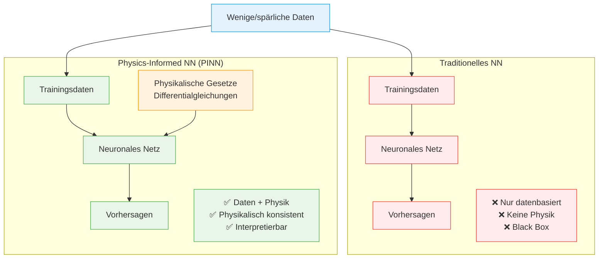

# Physik-Informierte Neuronale Netze (PINN)

Herkömmliche Neuronale Netze (NNs) sind zwar leistungsfähig, stoßen aber bei komplexen physikalischen Systemen auch mal an ihre Grenzen. Sie integrieren oft kein physikalisches Vorwissen, was zu inkonsistenten oder intransparenten Vorhersagen führen kann. Schließlich handelt es sich immer noch um Black-Boxes.

Eine Möglichkeit, dieses Problem zu adressieren, sind Physik-Informierte Neuronale Netze (PINNs). Sie integrieren grundlegende physikalische Prinzipien und Gesetze (oft Differentialgleichungen) in ihrem Lernprozess.

Man kombiniert sozusagen die Flexibililität von Neuronalen Netzen mit physikalischen Gesetzen.

--- 

## Was sind PINNs?

PINNs lernen, indem die physikalischen Gesetze in ihrer Verlustfunktion eingebettet werden. Das Neuronale Netz minimiert nicht nur den Fehler zu den Beobachtungsdaten, sondern wird zusätzlich bestraft, wenn die Vorhersagen des neuronalen Netzes physikalische Gesetze verletzen. 

> Ein kleines Beispiel: In einem geschlossenen, einfachen System erhöht sich die Temperatur, also sollte auch der Druck steigen. Tut er das nicht, scheint die Vorhersage das physikalische Gesetz zu verletzen. Diese Verletzung wird im Trainingsprozess in der Loss-Funktion berücksichtigt.

Was PINNs erst praktikabel macht, ist die **Automatische Differenzierung (AD)**. Viele physikalische Gesetze sind Differentialgleichungen - sie enthalten Ableitungen wie Geschwindigkeit (erste Ableitung der Position) oder Beschleunigung (zweite Ableitung). 

Zuvor war es oft extrem aufwendig, diese Ableitungen manuell zu berechnen. Mit AD können moderne Deep Learning Frameworks wie `TensorFlow` oder `PyTorch` diese Ableitungen automatisch und exakt berechnen. Das neuronale Netz lernt beispielsweise eine Position $x(t)$, und AD berechnet automatisch $dx/dt$ (Geschwindigkeit) und $d^{2}x/dt^{2}$ (Beschleunigung) - genau das, was für physikalische Gleichungen benötigt wird.

Physikalische Gesetze dienen außerdem als "Constraint", der das Lernen und den Trainingsprozess zu physikalisch konsistenten Lösungen lenkt. Das führt letztlich zu effizienterem, robusterem Lernen und besserer Generalisierungsfähigkeit auf ungesehene Szenarien.

Das führt auch dazu, dass ein PINN mit kleineren, spärlichen, unvollständigen Datensätzen trainiert werden kann, weil die Physik starkes Vorwissen liefert, während traditionelle NNs oft riesige Mengen hochwertiger Daten benötigen.

**Der entscheidende Unterschied zu herkömmlichen NNs:** Traditionelle neuronale Netze sind "Black Boxes" - sie liefern Ergebnisse, aber niemand kann erklären, wie sie zu diesen Vorhersagen kommen. PINNs hingegen sind ein Stück weit transparent: Ihre Vorhersagen müssen zwangsläufig den physikalischen Gesetzen folgen, die wir explizit in das Training eingebaut haben. Das macht sie nicht nur interpretierbarer, sondern auch deutlich vertrauenswürdiger für kritische Anwendungen.



---

## Vorteile von PINNs gegenüber Standard-NNs

PINNs bieten einige Vorteile gegenüber traditionellen neuronalen Netzen.

Zum einen wäre da die verbesserte Genauigkeit und Interpretierbarkeit. Sie liefern genauere und zuverlässigere Vorhersagen, insbesondere bei komplexen, nichtlinearen Systemen, wie beispielsweise bei der Beschreibung von Turbulenzen. Die Ergebnisse sind physikalisch plausibel, was natürlich für die Sicherheit und Zuverlässigkeit wichtig und entscheidend ist.

Ein weiterer Punkt ist die Dateneffizienz und Robustheit. PINNs reduzieren den Bedarf an großen, sauberen Datensätzen und können effektiv aus spärlichen oder verrauschten Daten lernen.

Auch die Geschwindigkeit, Skalierbarkeit und Effizienz sind nicht zu vernachlässigen. Nach dem Training liefern PINNs sehr schnelle Ergebnisse für Echtzeit-Inferenzen und Optimierungsprobleme. Außerdem reduzieren sie die Rechenlast im Vergleich zu rein numerischen Methoden.

PINNs sind auch exzellent bei inversen Problemen. Das Ziel ist es, unbekannte Parameter, Bedingungen oder Ursachen aus beobachteten Daten abzuleiten, beispielsweise Materialeigenschaften oder Randbedingungen. Das unterscheidet sie von Vorwärtsproblemen, bei denen es um die Vorhersage von Ergebnissen geht.

Aber PINNs können noch mehr als nur Probleme lösen. Sie können partielle Differentialgleichungen datengesteuert entdecken und sogar die zugrundeliegenden mathematischen Ausdrücke eines Systems durch symbolische Regression aufdecken. Damit wird KI zu einem echten Werkzeug für wissenschaftliche Entdeckungen, technische Designoptimierung und präzise Ursachenanalyse.

Genug Theorie, kommen wir zum praktischen Beispiel.

---

## Praktisches Beispiel: Feder-Masse-Dämpfer-System

Um die Funktionsweise eines PINN zu veranschaulichen, betrachten wir die Modellierung eines Feder-Masse-Dämpfer-Systems. Dieses System wird durch eine gewöhnliche Differentialgleichung (ODE) beschrieben, welche die Bewegung einer Masse unter Federkraft und Dämpfung darstellt:

$$m \cdot \frac{d^2x}{dt^2} + c \cdot \frac{dx}{dt} + k \cdot x = 0$$

Unser PINN wird lernen, die Auslenkung $x(t)$ über die Zeit $t$ zu approximieren, indem es diese ODE direkt in seine Verlustfunktion integriert.

### Die PINN-Verlustfunktion

Im Gegensatz zu traditionellen neuronalen Netzen ist die Verlustfunktion eines Physik-informierten neuronalen Netzes etwas komplexer aufgebaut. Sie besteht in unserem Beispiel im Wesentlichen aus drei Teilen:

1.  **Physik-Verlust:** Dieser Teil misst, wie gut das Modell die zugrunde liegende Differentialgleichung (ODE) an den Kollokationspunkten erfüllt.
2.  **Positions-Daten-Verlust:** Hier wird geprüft, wie gut das Modell mit den bekannten Positionsdaten übereinstimmt.
3.  **Geschwindigkeits-Daten-Verlust:** Dieser Term vergleicht die vom Modell berechnete Geschwindigkeit mit den tatsächlich vorhandenen Daten.

Zu den Gewichten später mehr. An dieser Stelle ist wichtig zu verstehen, dass es diese besonderen Verlustfunktion gibt.

### Umsetzung

Wir beginnen wieder mit den Imports, die sich dieses Mal wirklich in Grenzen halten.

```python
import tensorflow as tf
import numpy as np
import matplotlib.pyplot as plt
from typing import Dict, Any, Tuple
```

Und dann definieren ich die System-Parameter.

```python
class SystemParameters:
    def __init__(self, m: float = 1.0, c: float = 0.5, k: float = 10.0):
        self.mass = m  # Masse
        self.damping = c  # Dämpfungskoeffizient
        self.stiffness = k # Federkonstante
``` 

### `DataOnlyModel`

Es folgt die `DataOnlyModel` Klasse. Sie repräsentiert einen rein datenbasierten Ansatz zur Modellierung physikalischer Systeme. Sie dient als direkter Vergleichspartner zum PINN und zeigt, was passiert, wenn man versucht, komplexe Dynamiken ausschließlich aus wenigen Datenpunkten zu lernen.

```python
class DataOnlyModel(tf.keras.Model):
    def __init__(self):
        super().__init__()
        self.dense1 = tf.keras.layers.Dense(64, activation='tanh', name='dense_1')
        self.dense2 = tf.keras.layers.Dense(64, activation='tanh', name='dense_2')
        self.output_layer = tf.keras.layers.Dense(1, name='output_layer')
        
        self.total_loss_tracker = tf.keras.metrics.Mean(name="total_loss")
        self.data_pos_loss_tracker = tf.keras.metrics.Mean(name="data_pos_loss")
        self.data_vel_loss_tracker = tf.keras.metrics.Mean(name="data_vel_loss")

    def call(self, t: tf.Tensor) -> tf.Tensor:
        return self.output_layer(self.dense2(self.dense1(t)))

    @tf.function
    def data_loss_position(self, t_data: tf.Tensor, x_data: tf.Tensor) -> tf.Tensor:
        x_pred = self(t_data)
        return tf.reduce_mean(tf.square(x_pred - x_data))

    @tf.function
    def data_loss_velocity(self, t_data_vel: tf.Tensor, v_data_vel: tf.Tensor) -> tf.Tensor:
        with tf.GradientTape() as tape:
            tape.watch(t_data_vel)
            x_pred = self(t_data_vel)
        dx_dt_pred = tape.gradient(x_pred, t_data_vel)
        return tf.reduce_mean(tf.square(dx_dt_pred - v_data_vel))

    def train_step(self, data: Tuple[tf.Tensor, tf.Tensor]) -> Dict[str, tf.Tensor]:
        all_inputs_as_one_element, _ = data
        t_data_pos, x_data_pos, t_data_vel, v_data_vel = all_inputs_as_one_element
        
        with tf.GradientTape() as tape:
            loss_d_pos = self.data_loss_position(t_data_pos, x_data_pos)
            loss_d_vel = self.data_loss_velocity(t_data_vel, v_data_vel)
            total_loss = loss_d_pos + loss_d_vel

        gradients = tape.gradient(total_loss, self.trainable_variables)
        self.optimizer.apply_gradients(zip(gradients, self.trainable_variables))

        self.total_loss_tracker.update_state(total_loss)
        self.data_pos_loss_tracker.update_state(loss_d_pos)
        self.data_vel_loss_tracker.update_state(loss_d_vel)
        
        return {
            "total_loss": self.total_loss_tracker.result(),
            "data_pos_loss": self.data_pos_loss_tracker.result(),
            "data_vel_loss": self.data_vel_loss_tracker.result()
        }
    
    @property
    def metrics(self):
        return [self.total_loss_tracker, self.data_pos_loss_tracker, self.data_vel_loss_tracker]
```

#### Modellarchitektur

Das Modell verwendet dieselbe neuronale Netzwerkarchitektur wie das noch folgende PINN: Zwei Dense-Layer mit jeweils $64$ Neuronen und `tanh`-Aktivierung, gefolgt von einem linearen Output-Layer. Diese bewusste Übereinstimmung eliminiert Architektur-bedingte Unterschiede und stellt sicher, dass etwaige Leistungsunterschiede ausschließlich auf den Lernansatz zurückzuführen sind.

Das Netz nimmt einen Zeitpunkt $t$ als Input und soll die Position $x(t)$ vorhersagen - genau wie das PINN.

Der entscheidende Unterschied zum PINN liegt in der Verlustfunktion. Das `DataOnlyModel` kennt keine physikalischen Gesetze und lernt ausschließlich aus den verfügbaren Datenpunkten:

* **Positionsdaten-Verlust**: Standard Mean Squared Error zwischen vorhergesagter und tatsächlicher Position
* **Geschwindigkeitsdaten-Verlust**: Hier wird es interessant - das Modell berechnet die Ableitung seines Outputs mittels `tf.GradientTape` und vergleicht diese mit den gegebenen Geschwindigkeitsdaten

Das `DataOnlyModel` hat keine Ahnung davon, dass seine Vorhersagen die Feder-Masse-Dämpfer-Gleichung $m \cdot \frac{d^2x}{dt^2} + c \cdot \frac{dx}{dt} + k \cdot x = 0$ erfüllen müssen. Es kennt nur die wenigen gegebenen Datenpunkte und versucht, daraus eine Funktion zu interpolieren.

#### `@tf.function` - Performance-Optimierung

Die `@tf.function`-Decorators in unseren Verlustfunktionen sind wichtig für die Performance. Dieser Decorator wandelt Python-Funktionen in optimierte `TensorFlow`-Graphen um.

Ohne `@tf.function` würde jede einzelne Operation in Python interpretiert, was langsam und ineffizient wäre. Mit `@tf.function` hingegen kompiliert `TensorFlow` die Funktion beim ersten Aufruf in einen statischen Berechnungsgraphen und optimiert ihn. Alle folgenden Aufrufe sind dann deutlich schneller.

Das ist für unser `DataOnlyModel` besonders wichtig, weil die `data_loss_velocity`-Funktion Ableitungen mit `tf.GradientTape` berechnet. Das ist rechenintensiv, und diese Funktionen werden in jedem einzelnen Trainingsschritt aufgerufen, also tausende Male. Die Graph-Optimierung beschleunigt die Gradienten-Berechnungen dann erheblich.

In der Praxis bedeutet das: Der erste Trainingsschritt ist etwas langsamer, weil `TensorFlow` die Funktion erst kompilieren muss. Aber alle folgenden Schritte laufen dann deutlich schneller. Und bei $5000$ Epochen macht das einen enormen Unterschied!

Ich kann schon verraten, dass der Performance-Gewinn beim späteren PINN sogar noch dramatischer ist, weil wir dort noch komplexere, verschachtelte Gradient-Berechnungen für die zweiten Ableitungen haben.

#### `tf.GradientTape` - Automatische Ableitung

Das `tf.GradientTape` ist quasi TensorFlows Werkzeug für automatische Differenzierung (AD). Es zeichnet alle Operationen auf, während sie ausgeführt werden, und kann dann Ableitungen berechnen.

Du fragst dich jetzt vielleicht, warum unser `DataOnlyModel` das überhaupt braucht. Schauen wir uns dazu mal den Code an:

```python
with tf.GradientTape() as tape:
    tape.watch(t_data_vel)        # "Beobachte" die Zeitvariable
    x_pred = self(t_data_vel)     # Berechne Position
dx_dt_pred = tape.gradient(x_pred, t_data_vel)  # Ableite Geschwindigkeit
```

Der Grund ist folgender: Unser datenbasiertes Modell lernt ja nur die Position `x(t)`. Wir haben aber auch Geschwindigkeitsdaten, die wir zum Trainieren nutzen wollen. Um jetzt die Geschwindigkeit aus der Position zu berechnen, brauchen wir die Ableitung `dx/dt`. Und genau das macht `GradientTape` für uns, es berechnet sie automatisch.

Ohne `GradientTape` müssten wir die Ableitung manuell approximieren, zum Beispiel durch finite Differenzen. Das wäre aber ungenau und ziemlich aufwendig. Mit `GradientTape` bekommen wir die exakte Ableitung automatisch, was natürlich perfekt für unseren Geschwindigkeits-Verlust ist.

#### Benutzerdefinierter Trainingsschritt (`train_step`)

Der Kern dieses Modells liegt in seiner benutzerdefinierten `train_step`-Implementierung, die es ihm ermöglicht, aus verschiedenen Arten von Überwachungsdaten zu lernen.

Der `train_step` erwartet ein Tupel von vier Eingabetensoren:
* `t_initial_pos`, `x_initial_pos`: Zeitpunkte und zugehörige Positionen für die initiale Positionsinformation.
* `t_initial_vel`, `v_initial_vel`: Zeitpunkte und zugehörige Geschwindigkeiten für die initiale Geschwindigkeitsinformation.

Die Gesamtverlustfunktion (`total_loss`) setzt sich aus zwei Komponenten zusammen, die beide als Mean Squared Error (MSE) berechnet werden:
* **Positionsdaten-Verlust (`loss_data_pos`)**: Hier wird der direkte Output des Modells (`self(t_initial_pos)`) mit den tatsächlichen (`x_initial_pos`) Positionswerten verglichen. Das ist ein Standard-Regressionsverlust.
* **Geschwindigkeitsdaten-Verlust (`loss_data_vel`)**: Das ist eigentlich der interessantere Teil. Um die Geschwindigkeit zu erhalten, wird die Ableitung des Modell-Outputs nach der Zeit (`dxdt_at_t_initial_vel`) berechnet. Das geschieht mit Hilfe von `tf.GradientTape`, wobei `t_initial_vel` explizit "gewatcht" wird, damit die Ableitung bezüglich dieses Inputs verfolgt werden kann. Der berechnete Gradient (also die Steigung der vom Modell gelernten Positionsfunktion) wird dann mit der tatsächlichen Geschwindigkeit (`v_initial_vel`) verglichen.

Nachdem der `total_loss` berechnet wurde, nutzt die `tf.GradientTape` die aufgezeichneten Operationen, um die Gradienten des Gesamtverlusts bezüglich aller trainierbaren Parameter des Netzwerks (`self.trainable_variables`) zu berechnen. Diese Gradienten werden dann vom Optimierer (`self.optimizer.apply_gradients`) verwendet, um die Gewichte des Netzwerks anzupassen und den Verlust zu minimieren.

Der `train_step` gibt dann ein Dictionary mit den einzelnen Verlustkomponenten und dem Gesamtverlust zurück, was für das Monitoring des Trainingsfortschritts nützlich ist.

Insgesamt ist dieses Modell ein rein datengesteuertes Modell, das versucht, eine unbekannte physikalische Beziehung (Position als Funktion der Zeit) zu lernen, indem es sowohl direkte Positionsmessungen als auch Informationen über die Rate der Positionsänderung (Geschwindigkeit) in seine Verlustfunktion integriert. Es unterscheidet sich von klassischen Physics-Informed Neural Networks (PINNs), da es keine explizite Differentialgleichung als physikalische Restriktion im Verlustterm verwendet, sondern lediglich die Ableitung des Outputs für den Geschwindigkeitsvergleich heranzieht.

### `PINNModel`

```python
class PINNModel(tf.keras.Model):
    def __init__(self, system_params: SystemParameters, pinn_weights: Dict[str, float]):
        super().__init__()
        self.system_params = system_params
        self.pinn_weights = pinn_weights
        self.dense1 = tf.keras.layers.Dense(64, activation='tanh', name='dense_1')
        self.dense2 = tf.keras.layers.Dense(64, activation='tanh', name='dense_2')
        self.output_layer = tf.keras.layers.Dense(1, name='output_layer')

        self.total_loss_tracker = tf.keras.metrics.Mean(name="total_loss")
        self.physics_loss_tracker = tf.keras.metrics.Mean(name="physics_loss")
        self.data_pos_loss_tracker = tf.keras.metrics.Mean(name="data_pos_loss")
        self.data_vel_loss_tracker = tf.keras.metrics.Mean(name="data_vel_loss")

    def call(self, t: tf.Tensor) -> tf.Tensor:
        return self.output_layer(self.dense2(self.dense1(t)))


    @tf.function
    def physics_loss(self, t_collocation: tf.Tensor) -> tf.Tensor:
        with tf.GradientTape(persistent=True) as tape:
            tape.watch(t_collocation)
            x = self(t_collocation) 
            dx_dt = tape.gradient(x, t_collocation)
            d2x_dt2 = tape.gradient(dx_dt, t_collocation)
        
        ode_residual = self.system_params.mass * d2x_dt2 + self.system_params.damping * dx_dt + self.system_params.stiffness * x
        return tf.reduce_mean(tf.square(ode_residual))

    @tf.function
    def data_loss_position(self, t_data: tf.Tensor, x_data: tf.Tensor) -> tf.Tensor:
        x_pred = self(t_data)
        return tf.reduce_mean(tf.square(x_pred - x_data))

    @tf.function
    def data_loss_velocity(self, t_data_vel: tf.Tensor, v_data_vel: tf.Tensor) -> tf.Tensor:
        with tf.GradientTape() as tape:
            tape.watch(t_data_vel)
            x_pred = self(t_data_vel)
        dx_dt_pred = tape.gradient(x_pred, t_data_vel)
        return tf.reduce_mean(tf.square(dx_dt_pred - v_data_vel))

    def train_step(self, data: Tuple[tf.Tensor, tf.Tensor]) -> Dict[str, tf.Tensor]:
        all_inputs_as_one_element, _ = data
        t_collocation, t_data_pos, x_data_pos, t_data_vel, v_data_vel = all_inputs_as_one_element

        with tf.GradientTape() as tape:
            loss_p = self.physics_loss(t_collocation)
            loss_d_pos = self.data_loss_position(t_data_pos, x_data_pos)
            loss_d_vel = self.data_loss_velocity(t_data_vel, v_data_vel)
            
            total_loss = (self.pinn_weights.get('w_p', 1.0) * loss_p +
                          self.pinn_weights.get('w_d_pos', 1.0) * loss_d_pos +
                          self.pinn_weights.get('w_d_vel', 1.0) * loss_d_vel)

        gradients = tape.gradient(total_loss, self.trainable_variables)
        self.optimizer.apply_gradients(zip(gradients, self.trainable_variables))

        self.total_loss_tracker.update_state(total_loss)
        self.physics_loss_tracker.update_state(loss_p)
        self.data_pos_loss_tracker.update_state(loss_d_pos)
        self.data_vel_loss_tracker.update_state(loss_d_vel)
        
        return {
            "total_loss": self.total_loss_tracker.result(),
            "physics_loss": self.physics_loss_tracker.result(),
            "data_pos_loss": self.data_pos_loss_tracker.result(),
            "data_vel_loss": self.data_vel_loss_tracker.result()
        }

    @property
    def metrics(self):
        return [self.total_loss_tracker, self.physics_loss_tracker,
                self.data_pos_loss_tracker, self.data_vel_loss_tracker]
``` 

#### Modellarchitektur (PINNModel)

Das neuronale Netz, das ich hier verwende, ist vom Aufbau her identisch mit meinem `DataOnlyModel`. Es besteht aus zwei Dense-Layern mit `tanh`-Aktivierung und einem einzelnen linearen Output-Layer. Auch hier soll das Netz die Position `x` als Funktion der Zeit `t` approximieren.

Im Gegensatz zum vorherigen Modell werden hier aber zusätzliche Systemparameter (`mass`, `damping`, `stiffness`) übergeben. Diese `system_params` sind feste Werte aus der realen Physik, die das System beschreiben, das wir modellieren wollen, ein Masse-Feder-Dämpfer-System.

Entscheidend für PINNs sind auch die bereits erwähnten `pinn_weights`. Diese Gewichtungen steuern, wie wichtig die verschiedenen Verlustanteile im Training sind. Zu
 
#### Benutzerdefinierter Trainingsschritt (train_step)

Der `train_step` ist hier etwas komplexer, weil er drei verschiedene Arten von "Fehlern" (oder Verlusten) berücksichtigt.

Da wäre zunächst der **Daten-Input**: Neben den bekannten Datenpunkten für die Startposition (`t_initial_pos`, `x_initial_pos`) und die Startgeschwindigkeit (`t_initial_vel`, `v_initial_vel`) kommt hier ein neuer Typ hinzu: die sogenannten **Kollokationspunkte** (`t_collocation`). Das sind Zeitpunkte, die wir zufällig wählen, um zu überprüfen, ob unser Modell die physikalischen Gesetze erfüllt.

> Kollokationspunkte sind strategisch ausgewählte Punkte im Definitionsbereich der Differentialgleichung, an denen das neuronale Netz die physikalischen Gesetze erfüllen muss.
>
> Im Gegensatz zu traditionellen numerischen Methoden, die auf einem festen Gitter arbeiten, können Kollokationspunkte flexibel verteilt werden. Sie ermöglichen es, die physikalischen Gesetze kontinuierlich im gesamten Definitionsbereich durchzusetzen. Je mehr Kollokationspunkte verwendet werden, desto strenger wird die physikalische Konsistenz überwacht.
> 
> Es gibt verschiedene Strategien für die Verteilung der Kollokationspunkte:
>
> *   **Gleichmäßige Verteilung**: Das ist der einfachste Ansatz und funktioniert gut für glatte Lösungen.
> *   **Adaptive Verteilung**: Hier werden mehr Punkte in Bereichen mit hoher Krümmung oder Gradienten gesetzt.
> *   **Zufällige Verteilung**: Kann bei komplexen Geometrien vorteilhaft sein.
>
> In unserem Feder-Masse-Dämpfer-Beispiel werden wir $200$ gleichmäßig verteilte Kollokationspunkte über den Zeitbereich $0$ bis $5$ Sekunden verwenden. An jedem dieser Punkte muss das PINN die Gleichung $m \cdot \frac{d^2x}{dt^2} + c \cdot \frac{dx}{dt} + k \cdot x = 0$ erfüllen.

Dann gibt es noch die **Ableitungen (`tf.GradientTape(persistent=True)`)**: `persistent=True` ermöglicht es, das gleiche Tape für mehrere Gradient-Berechnungen zu verwenden. Das ist wichtig, weil wir nicht nur die erste Ableitung (also die Geschwindigkeit), sondern auch die zweite Ableitung (die Beschleunigung) des Modell-Outputs nach der Zeit benötigen. Dabei werden mit `tape.watch()` alle Input-Zeiten (`t_collocation`, `t_initial_pos`) "überwacht", damit wir deren Ableitungen berechnen können.

Und schließlich der **Verlust durch physikalische Gesetze (`ode_loss`)**: Das Modell sagt die Position an den Kollokationspunkten (`x_pred_collocation`) voraus. Dann werden die erste Ableitung (`dxdt_collocation`, also die vom Modell vorhergesagte Geschwindigkeit) und die zweite Ableitung (`d2xdt2_collocation`, also die vom Modell vorhergesagte Beschleunigung) bezüglich der Zeit `t_collocation` berechnet. Diese Ableitungen werden dann in die physikalische Gleichung eingesetzt, in unserem Beispiel in die Gleichung für eine gedämpfte Schwingung: $m \cdot \frac{d^2x}{dt^2} + c \cdot \frac{dx}{dt} + k \cdot x = 0$. Der `ode_loss` misst dann, wie stark die linke Seite dieser Gleichung von Null abweicht. Wenn das Modell die Physik perfekt lernt, sollte dieser Verlust idealerweise Null sein.

Der **Verlust durch Positionsdaten (`loss_data_pos`)** funktioniert identisch zum `DataOnlyModel`. Hier findet ein direkter Vergleich der vom Modell vorhergesagten Position mit den echten Positionsdaten statt. Das Gleiche gilt für den **Verlust durch Geschwindigkeitsdaten (`loss_data_vel`)**: Auch hier vergleichen wir die vom Modell abgeleitete Geschwindigkeit mit den echten Geschwindigkeitsdaten, wie im `DataOnlyModel`.

Der **Gesamtverlust (`total_loss`)** ist dann eine gewichtete Summe all dieser drei Verlustanteile. Die `pinn_weights` (`w_p`, `w_d_pos`, `w_d_vel`) bestimmen, wie stark das Modell auf die Erfüllung der Physik, die Übereinstimmung mit den Positionsdaten und die Übereinstimmung mit den Geschwindigkeitsdaten achten soll. Diese Gewichtungen sind wichtig für die Stabilität und Konvergenz von PINNs.

> Einer der kritischen Aspekte bei PINNs ist die Balance zwischen verschiedenen Verlustkomponenten. In unserem Beispiel verwende ich folgende Gewichtungen:
> 
> ```python
> pinn_weights = {
>     'w_p': 10.0,      # Physik-Verlust 
>     'w_d_pos': 1.0,   # Positions-Daten-Verlust
>     'w_d_vel': 5.0    # Geschwindigkeits-Daten-Verlust
> }
> ```
> 
>  Ich gewichte die Physik (`w_p`) mit $10.0$ recht hoch, damit das Modell die physikalischen Gesetze strikt befolgt. Das Geschwindigkeits-Gewicht (`w_d_vel`) ist mit $5.0$ stärker gewichtet als die Position, weil die Geschwindigkeitsinformation für die Dynamik wichtig ist. Für das Positions-Gewicht (`w_d_pos`) habe ich eine Basisgewichtung von $1.0$ für die Startposition gewählt.
> 
> Eine falsche Gewichtung kann aber auch schnell mal zu Problemen führen: Zum Beispiel physikalisch inkonsistente Lösungen, wenn `w_p` zu niedrig ist, oder eine schlechte Anpassung an die Daten, wenn `w_p` zu hoch ist. Und im schlimmsten Fall kann es zu einem instabilen Training kommen, wenn die Verhältnisse unausgewogen sind.
> 
> Die optimale Gewichtung ist oft problemspezifisch und erfordert einiges an experimentellem Feintuning. Die obige Verteilung habe ich durch Ausprobieren definiert.

Abschließend werden wie gehabt die Gradienten des `total_loss` bezüglich der trainierbaren Parameter des Netzwerks berechnet und zur Aktualisierung der Gewichte des Modells verwendet.

### Analytical Solution

Die Funktion `analytical_solution` dient dazu, die exakte Position eines gedämpften harmonischen Oszillators zu einem bestimmten Zeitpunkt `t` zu berechnen. Dabei berücksichtigt sie beliebige Anfangsbedingungen.

```python
def analytical_solution(t: np.ndarray, params: SystemParameters) -> np.ndarray:
    zeta = params.damping / (2 * np.sqrt(params.mass * params.stiffness)) 
    omega_n = np.sqrt(params.stiffness / params.mass)  
    
    x0 = 0.0
    v0 = 1.0
    
    if abs(zeta - 1.0) < 1e-6:
        C1 = x0
        C2 = v0 + omega_n * x0
        return (C1 + C2 * t) * np.exp(-omega_n * t)
        
    elif zeta < 1:
        omega_d = omega_n * np.sqrt(1 - zeta**2)
        C1 = x0
        C2 = (v0 + zeta * omega_n * x0) / omega_d
        return np.exp(-zeta * omega_n * t) * (C1 * np.cos(omega_d * t) + C2 * np.sin(omega_d * t))
        
    else:
        discriminant = np.sqrt(zeta**2 - 1)
        alpha1 = omega_n * (-zeta + discriminant)
        alpha2 = omega_n * (-zeta - discriminant)
        
        A2 = (v0 - alpha1 * x0) / (alpha2 - alpha1)
        A1 = x0 - A2
        return A1 * np.exp(alpha1 * t) + A2 * np.exp(alpha2 * t)
``` 


Schauen wir uns die Eingabeparameter mal genauer an:

*   **`t`**: Das ist der Zeitpunkt, für den wir die Position berechnen wollen.
*   **`system_params`**: Hierüber übergeben wir die Masse (`m`), Dämpfung (`c`) und Steifigkeit (`k`) des Systems.
*   **`x0`**: Die Anfangsposition des Oszillators zum Zeitpunkt `t=0`.
*   **`v0`**: Die Anfangsgeschwindigkeit des Oszillators zum Zeitpunkt `t=0`.

Im ersten Schritt berechnen wir die ungedämpfte Eigenfrequenz (`omega_n`$=\omega_n$) und den Dämpfungsgrad (`zeta`$=\zeta$). Der Dämpfungsgrad ist wichtig, um festzustellen, welcher der drei Dämpfungsfälle vorliegt.

Die Kernlogik besteht aus einer Fallunterscheidung, je nachdem welcher Dämpfungsfall vorliegt. Wichtig ist, dass die Konstanten in den jeweiligen Lösungsformeln dynamisch aus den übergebenen `x0` und `v0` Werten berechnet werden.

*   **Kritisch gedämpfter Fall ($\zeta$ ist nahe $1.0$)**:
    *   Die Konstanten $C_1$ und $C_2$ werden direkt aus $x_0$ und $v_0$ abgeleitet.
    *   Die Position wird mit der Formel $x(t) = (C_1 + C_2 t) e^{-\omega_n t}$ berechnet.
*   **Unterdämpfter Fall ($\zeta < 1.0$)**:
    *   Die gedämpfte Eigenfrequenz $\omega_d$ wird berechnet.
    *   Die Konstanten $C_1$ und $C_2$ (die nun die Amplitude und Phase der Schwingung bestimmen) werden aus $x_0$ und $v_0$ abgeleitet.
    *   Die Position wird mit der Formel $x(t) = e^{-\zeta \omega_n t}(C_1 \cos(\omega_d t) + C_2 \sin(\omega_d t))$ berechnet.
*   **Überdämpfter Fall ($\zeta > 1.0$)**:
    *   Die beiden charakteristischen Wurzeln $\alpha_1$ und $\alpha_2$ der Lösung werden berechnet.
    *   Die Konstanten $A_1$ und $A_2$ werden durch das Lösen eines linearen Gleichungssystems, das durch $x_0$ und $v_0$ gegeben ist, bestimmt.
    *   Die Position wird mit der Formel $x(t) = A_1 e^{\alpha_1 t} + A_2 e^{\alpha_2 t}$ berechnet.


Die Funktion gibt dann die berechnete Position $x$ des Oszillators zum Zeitpunkt t$ zurück, die nun die spezifischen Anfangsbedingungen $x0$ und $v0$ korrekt widerspiegelt.

Im Kontext von Machine Learning und Physik-informierten neuronalen Netzen dient diese erweiterte Funktion als "Ground Truth" oder Referenzlösung. Durch die größere Flexibilität können wir die Leistung der neuronalen Netze (insbesondere des PINN-Modells) unter einer breiteren Palette von Anfangsbedingungen evaluieren. Das ist wichtig, um die Robustheit und Generalisierungsfähigkeit des PINN zu gewährleisten.

### `CustomProgressLogger`

Dieser Keras Callback dient dazu, den Fortschritt des Trainings zu protokollieren und auszugeben. Dabei kann ich mit dem `log_interval` festlegen, wie oft eine entsprechende Meldung ausgegeben werden soll.

```python
class CustomProgressLogger(tf.keras.callbacks.Callback):
    def __init__(self, log_interval: int = 1000):
        super().__init__()
        self.log_interval = log_interval

    def on_epoch_end(self, epoch: int, logs: Dict[str, Any] = None):
        if logs is None:
            logs = {}
        if epoch % self.log_interval == 0 or epoch == self.params['epochs'] - 1:
            total_loss = logs.get('total_loss', 'N/A')
            physics_loss = logs.get('physics_loss', 'N/A')
            data_pos_loss = logs.get('data_pos_loss', 'N/A')
            data_vel_loss = logs.get('data_vel_loss', 'N/A')
            
            if 'physics_loss' in logs:
                print(f"Epoch {epoch:05d}: Total Loss: {total_loss:.4e}, "
                      f"Physics Loss: {physics_loss:.4e}, "
                      f"Pos Data Loss: {data_pos_loss:.4e}, "
                      f"Vel Data Loss: {data_vel_loss:.4e}")
            else: 
                print(f"Epoch {epoch:05d}: Total Loss: {total_loss:.4e}, "
                      f"Pos Data Loss: {data_pos_loss:.4e}, "
                      f"Vel Data Loss: {data_vel_loss:.4e}")
``` 

Die Ausgabe erfolgt immer am Ende einer Epoche, und zwar dann, wenn die Epochennummer ein Vielfaches des festgelegten `log_interval` ist oder wenn die letzte Epoche des Trainings erreicht wurde.

Was die Anzeige betrifft, so werden die verschiedenen Verlustwerte protokolliert: der Gesamtverlust, der Physikverlust sowie der Datenverlust für Position und Geschwindigkeit.

Die Ausgabe ist so formatiert, dass sie sich anpasst, je nachdem, ob es sich um ein PINN-Modell handelt, das ja einen Physikverlust hat, oder um ein rein datenbasiertes Modell.

Kurz gesagt: Es handelt sich um einen anpassbaren Fortschrittslogger, der mich während des Keras-Trainings gezielt über die wichtigsten Verlustwerte informiert.

### `prepare_data` Funktion

Diese Funktion dient dazu, alle Zeitpunkte und Anfangswerte vorzubereiten, die wir für das Training unserer Modelle und das spätere Plotten der Ergebnisse benötigen.

```python
def prepare_data(config: Dict[str, Any]) -> Dict[str, tf.Tensor]:
    t_initial_pos = tf.constant([[0.0]], dtype=tf.float32)
    x_initial_pos = tf.constant([[0.0]], dtype=tf.float32)  
    t_initial_vel = tf.constant([[0.0]], dtype=tf.float32)
    v_initial_vel = tf.constant([[1.0]], dtype=tf.float32)  

    t_collocation_pinn = tf.constant(
        np.linspace(0, config['plot_time_range'][1], config['num_collocation_points'])[:, None], 
        dtype=tf.float32
    )

    t_plot_np = np.linspace(*config['plot_time_range'])[:, None]
    t_plot_tf = tf.constant(t_plot_np, dtype=tf.float32)

    return {
        't_initial_pos': t_initial_pos, 'x_initial_pos': x_initial_pos,
        't_initial_vel': t_initial_vel, 'v_initial_vel': v_initial_vel,
        't_collocation_pinn': t_collocation_pinn,
        't_plot_np': t_plot_np, 't_plot_tf': t_plot_tf
    }
``` 

Ich erstelle `TensorFlow`-Tensoren für die Anfangsposition `x(0)=0` und die Anfangsgeschwindigkeit `dtdx(0)=1`. Zusätzlich generiere ich eine Reihe von gleichmäßig verteilten Zeitpunkten (`t_collocation_pinn`), die das PINN-Modell verwendet, um die physikalischen Gleichungen zu "überprüfen".

Für die Visualisierung der Ergebnisse erstelle ich sowohl `NumPy`-Arrays als auch `TensorFlow`-Tensoren für die Zeitachse, die später verwendet werden, um die Vorhersagen zu generieren.

Die Funktion gibt dann ein Dictionary mit all diesen vorbereiteten Tensoren und `NumPy`-Arrays zurück. Sie sammelt und formatiert alle notwendigen Eingangsdaten (Anfangswerte, Zeitpunkte für Training und Plot) in einem zentralen Schritt.

### `train_model` 

Diese Funktion dient dazu, ein beliebiges Keras-Modell zu trainieren. Dabei kompiliere ich das übergebene `model` mit dem Adam-Optimierer und der angegebenen `learning_rate`.

```python
def train_model(
    model: tf.keras.Model, 
    dataset: tf.data.Dataset, 
    epochs: int, 
    learning_rate: float, 
    early_stopping_config: Dict[str, Any],
    log_interval: int,
    model_name: str
) -> tf.keras.callbacks.History:

    print(f"\n--- Training {model_name} Model ---")
    model.compile(optimizer=tf.keras.optimizers.Adam(learning_rate=learning_rate))

    callbacks = []

    if model_name == "PINN" and early_stopping_config:
        early_stopping_callback = tf.keras.callbacks.EarlyStopping(
            monitor=early_stopping_config['monitor'],
            patience=early_stopping_config['patience'],
            min_delta=early_stopping_config['min_delta'],
            mode=early_stopping_config['mode'],
            verbose=early_stopping_config['verbose'],
            restore_best_weights=True
        )
        callbacks.append(early_stopping_callback)

    progress_logger = CustomProgressLogger(log_interval=log_interval)
    progress_logger.params = {'epochs': epochs}
    callbacks.append(progress_logger)

    history = model.fit(
        dataset,
        steps_per_epoch=1, 
        epochs=epochs,
        callbacks=callbacks,
        verbose=0 
    )
    print(f"\n{model_name} Training finished after {len(history.history['total_loss'])} epochs.")
    return history
```

Zusätzlich füge ich noch ein paar Callbacks hinzu:
*   Einen **EarlyStopping**-Callback gibt es aber nur, wenn es sich um das "PINN"-Modell handelt und die Konfiguration dafür vorhanden ist. Dieser Callback sorgt dafür, dass das Training frühzeitig gestoppt wird, wenn sich der Verlust nicht mehr verbessert.
*   Den `CustomProgressLogger` füge ich immer hinzu. Er gibt den Trainingsfortschritt regelmäßig aus.

Anschließend rufe ich die `fit`-Methode des Modells auf, um das Training mit dem bereitgestellten `dataset` und den definierten `callbacks` zu starten. Die Standard-Keras-Ausgabe unterdrücke ich dabei (`verbose=0`), da der `CustomProgressLogger` die Ausgabe übernimmt.

Nach Abschluss des Trainings gibt es das `history`-Objekt zurück. In diesem Objekt sind Informationen über den Trainingsverlauf (z.B. Verlustwerte pro Epoche) enthalten.

Die Funktion kapselt den gesamten Trainingsprozess für ein Keras-Modell. Das beinhaltet die Kompilierung, das Anwenden von Callbacks und die eigentliche `fit`-Operation. Am Ende gibt sie den Trainingsverlauf zurück.

### `plot_results`-Funktion

Die Funktion visualisiert die Ergebnisse, indem sie die Vorhersagen beider trainierter Modelle (PINN und datenbasiert) gegen die bekannte analytische Lösung und die ursprünglichen Trainingsdaten plotet.


```python
def plot_results(
    t_plot_np: np.ndarray, 
    x_pred_pinn: np.ndarray, 
    x_pred_data_only: np.ndarray, 
    x_analytical: np.ndarray,
    initial_data: Dict[str, tf.Tensor],
    config: Dict[str, Any]
):

    plt.figure(figsize=(12, 7))
    plt.plot(t_plot_np, x_analytical, 'k--', linewidth=2, label='Analytische Lösung')
    
    pinn_label = (f'PINN (w_p={config["pinn_weights"]["w_p"]}, '
                  f'w_d_pos={config["pinn_weights"]["w_d_pos"]}, '
                  f'w_d_vel={config["pinn_weights"]["w_d_vel"]})')
    plt.plot(t_plot_np, x_pred_pinn, 'b-', linewidth=1.5, label=pinn_label)
    plt.plot(t_plot_np, x_pred_data_only, 'r:', linewidth=1.5, label='Rein Datenbasierte NN Vorhersage')
    
    plt.plot(initial_data['t_initial_pos'].numpy(), initial_data['x_initial_pos'].numpy(), 
             'go', markersize=8, label='Trainingsdaten (x(0))')
    plt.plot(initial_data['t_initial_vel'].numpy(), initial_data['v_initial_vel'].numpy() * 0, 
             'rx', markersize=8, label='Trainingsdaten (dx/dt(0))') 

    plt.xlabel('Zeit (t)', fontsize=12)
    plt.ylabel('Auslenkung (x)', fontsize=12)
    plt.title('Vergleich: Feder-Masse-Dämpfer-System (PINN vs. Rein Datenbasiert)', fontsize=14)
    plt.legend(fontsize=10)
    plt.grid(True)
    plt.tight_layout()
    plt.show()
```

Die `plot_results`-Funktion, erstellt einen Vergleichsplot, der alle wichtigen Elemente auf einen Blick vereint.

Der Hauptzweck ist ein visueller Vergleich aller drei Ansätze – analytisch, PINN und rein datenbasiert – in einem übersichtlichen Plot. So kann man direkt sehen, wie gut die Modelle im Vergleich zur exakten Lösung und zueinander abschneiden.

### `main`-Funktion

```python
def main():
    config: Dict[str, Any] = {
        'epochs_pinn': 50_000, 
        'epochs_data_only': 5_000,
        'learning_rate': 0.001,
        'pinn_weights': {'w_p': 10.0, 'w_d_pos': 1.0, 'w_d_vel': 5.0},
        'num_collocation_points': 200,
        'plot_time_range': (0, 5, 200), 
        'early_stopping': {
            'monitor': 'total_loss', 
            'patience': 1000,       
            'min_delta': 5e-4,      
            'mode': 'min',          
            'verbose': 1            
        },
        'log_interval': 1000 
    }
    
    system_params = SystemParameters()
    data_tensors = prepare_data(config)

    pinn_model = PINNModel(system_params, config['pinn_weights'])
    pinn_dataset = tf.data.Dataset.from_tensors(
        ((data_tensors['t_collocation_pinn'], data_tensors['t_initial_pos'], data_tensors['x_initial_pos'], 
          data_tensors['t_initial_vel'], data_tensors['v_initial_vel']), 
         tf.constant([0.0], dtype=tf.float32)) 
    ).repeat() 

    history_pinn = train_model(
        pinn_model, 
        pinn_dataset, 
        config['epochs_pinn'], 
        config['learning_rate'], 
        config['early_stopping'],
        config['log_interval'],
        "PINN"
    )

    data_only_model = DataOnlyModel()
    data_only_dataset = tf.data.Dataset.from_tensors(
        ((data_tensors['t_initial_pos'], data_tensors['x_initial_pos'], 
          data_tensors['t_initial_vel'], data_tensors['v_initial_vel']),
         tf.constant([0.0], dtype=tf.float32)) 
    ).repeat()

    history_data_only = train_model(
        data_only_model, 
        data_only_dataset, 
        config['epochs_data_only'], 
        config['learning_rate'], 
        {},
        config['log_interval'],
        "Data-Only NN"
    )

    x_pred_pinn = pinn_model(data_tensors['t_plot_tf']).numpy()
    x_pred_data_only = data_only_model(data_tensors['t_plot_tf']).numpy()
    x_analytical = analytical_solution(data_tensors['t_plot_np'], system_params)

    plot_results(
        data_tensors['t_plot_np'], 
        x_pred_pinn, 
        x_pred_data_only, 
        x_analytical,
        data_tensors,
        config
    )

    print("\nVergleichstraining und Plot abgeschlossen.")
```

Die `main`-Funktion ist das Herzstück des Programms, sie steuert den gesamten Ablauf. Im Wesentlichen konfiguriert man hier alle wichtigen Parameter für das Training und die Visualisierung. Dazu gehören Dinge wie die Anzahl der Epochen, die Lernrate, verschiedene Gewichtungen und der Bereich, in dem die Ergebnisse geplott werden sollen.

Zuerst werden die physikalischen Parameter des Systems initialisiert, also Masse, Dämpfung und Steifigkeit. Danach rufe ich `prepare_data` auf. Diese Funktion erstellt alle TensorFlow-Tensoren, die später für das Training und das Plotten benötigt werden.

Anschließend kommt der spannende Teil: das Training der beiden Modelle.

*   **PINN-Training:** Zuerst initialisiere ich das `PINNModel`. Dann erzeuge ich das passende `tf.data.Dataset` und rufe `train_model` auf, um das PINN zu trainieren. Hier ist auch Early Stopping aktiviert, um ein Overfitting zu vermeiden.
*   **Datenbasiertes NN-Training:** Danach initialisiere ich das `DataOnlyModel` und erstelle das entsprechende `tf.data.Dataset`. Auch hier wird `train_model` aufgerufen, um das rein datenbasierte NN zu trainieren.

Nach dem Training generiere ich mit den trainierten Modellen Vorhersagen für den gesamten Plot-Zeitbereich. Zusätzlich berechne ich die analytische Lösung, um einen Vergleich zu haben.

Zum Schluss werden die Ergebnisse geplottet. Die Funktion `plot_results` stellt die Ergebnisse grafisch dar, sodass man PINN, datenbasiertes NN und die analytische Lösung direkt miteinander vergleichen kann.

Wenn alles durchgelaufen ist, gibt es noch eine Abschlussmeldung, die signalisiert, dass alle Schritte erfolgreich beendet wurden.

### Training und Ergebnisse

Nun wird es aber Zeit die Modelle zu trainieren. Ich führe also das Skript aus und zunächst erhalte ich diese Ausgaben. Eine Interpretation erfolgt im nächsten Abschnitt.

Zunächst der Trainingsverlauf des PINNs.

```bash
--- Training PINN Model ---
Epoch 00000: Total Loss: 1.1973e+02, Physics Loss: 1.1230e+01, Pos Data Loss: 0.0000e+00, Vel Data Loss: 1.4862e+00
Epoch 01000: Total Loss: 2.6340e+00, Physics Loss: 1.0341e-01, Pos Data Loss: 9.6072e-03, Vel Data Loss: 3.1806e-01
[...]
Epoch 39000: Total Loss: 1.6668e-01, Physics Loss: 1.6599e-02, Pos Data Loss: 9.7122e-05, Vel Data Loss: 1.1815e-04
Epoch 39791: early stopping
Restoring model weights from the end of the best epoch: 38791.

PINN Training finished after 39791 epochs.
```

Und dann der Trainingsverlauf des datenbasierten NNs.

```bash
--- Training Data-Only NN Model ---
Epoch 00000: Total Loss: 2.1020e+00, Pos Data Loss: 0.0000e+00, Vel Data Loss: 2.1020e+00
Epoch 01000: Total Loss: 0.0000e+00, Pos Data Loss: 0.0000e+00, Vel Data Loss: 0.0000e+00
Epoch 02000: Total Loss: 0.0000e+00, Pos Data Loss: 0.0000e+00, Vel Data Loss: 0.0000e+00
Epoch 03000: Total Loss: 0.0000e+00, Pos Data Loss: 0.0000e+00, Vel Data Loss: 0.0000e+00
Epoch 04000: Total Loss: 0.0000e+00, Pos Data Loss: 0.0000e+00, Vel Data Loss: 0.0000e+00
Epoch 04999: Total Loss: 0.0000e+00, Pos Data Loss: 0.0000e+00, Vel Data Loss: 0.0000e+00

Data-Only NN Training finished after 5000 epochs.
```

Und schließlich der durch die Funktion erzeugte Plot, der die Verläufe vergleicht.


#### Der direkte Vergleich

Im obigen Plot sind mehrere Kurven dargestellt, auf die ich im folgenden kurz eingehen möchte.

**Analytische Lösung** (schwarz gestrichelt): Die erwartete perfekt gedämpfte Sinusschwingung.

**PINN** (blau durchgezogen): Folgt der analytischen Lösung nahezu perfekt über den gesamten Zeitbereich, obwohl es dieselben spärlichen Anfangsdaten erhält. Die physikalische Verlustfunktion zwingt das Modell, eine Lösung zu finden, die die zugrunde liegende Dynamik des Feder-Masse-Dämpfer-Systems zu jedem Zeitpunkt erfüllt.
> Ich habe ein paar Parameter gezielt so verändert, dass die Ergebnisse nicht mehr perfekt der analytischen Lösung entsprechen. So kann man aber alle Kurven besser sehen.

**Datenbasiertes NN** (rot gepunktet): Lernt nur aus den zwei extrem spärlichen Anfangsbedingungen. Ohne das Wissen um die physikalische Differentialgleichung kann es die komplexe Schwingungsbewegung nicht extrapolieren. Seine Vorhersage driftet nach den wenigen bekannten Punkten schnell in physikalisch unsinnige Bereiche ab.

#### Die "Null-Verluste" des datenbasierten Modells

Ein besonders aufschlussreicher Aspekt der Trainingsergebnisse ist, dass das datenbasierte Modell ab Epoche $1000$ "Null-Verluste" liefert:

```bash
Epoch 01000: Total Loss: 0.0000e+00, Pos Data Loss: 0.0000e+00, Vel Data Loss: 0.0000e+00
```

Null-Verluste bedeuten nicht, dass das Modell perfekt ist, sondern dass es die wenigen Trainingsdaten (wir hatten ja nur zwei Anfangsbedingungen) auswendig gelernt hat. Das Modell ist stark überangepasst und kann nicht generalisieren.

Das passiert, weil wir zu wenige Datenpunkte im Verhältnis zur Modellkomplexität haben. Das Netz kann die spärlichen Daten einfach perfekt memorieren. Und ohne Regularisierung oder zusätzliche Constraints (wie die Physik im PINN) entstehen wild schwankende Vorhersagen zwischen den Datenpunkten.

Im Kontrast dazu das PINN: Es zeigt stabile, nicht-null Verluste, was ein gutes Zeichen ist. Der Physik-Verlust fungiert hier als natürliche Regularisierung und verhindert Overfitting durch kontinuierliche physikalische Constraints an den Kollokationspunkten.

Bei maschinellem Lernen mit spärlichen Daten sind Null-Verluste oft ein Zeichen für Probleme, nicht für Erfolg. PINNs lösen dieses Problem elegant, indem sie Domänenwissen integrieren.

#### Warum das PINN überlegen ist

Das PINN "kennt" die physikalische Gleichung des Systems. Selbst mit minimalen Daten wird es durch die physikalische Verlustfunktion gezwungen, eine Lösung zu finden, die den Gesetzen der Physik gehorcht. Das datenbasierte Modell hingegen "erfindet" eine Funktion, die die Startpunkte trifft, aber keine Ahnung von der zugrunde liegenden Dynamik hat.

**Robustheit bei spärlichen Daten**: Das PINN liefert physikalisch plausible Vorhersagen, auch wenn nur wenige Datenpunkte verfügbar sind.

**Physikalische Konsistenz**: Die Vorhersagen bleiben auch außerhalb der Trainingsdaten korrekt und vertrauenswürdig. Und genau das ist wichtig für reale Anwendungen, wo Daten oft unvollständig sind.

Der geringe, aber stabile Physik-Loss zeigt, dass das PINN die Physik "versteht". Das macht es zu einem robusten und vertrauenswürdigen Werkzeug für wissenschaftliche und technische Anwendungen.

--- 

## Grenzen und Herausforderungen von PINNs

Trotz ihrer beeindruckenden Fähigkeiten haben PINNs auch einige Limitationen, die man bei der praktischen Anwendung berücksichtigen sollte:

### Rechenaufwand und Trainingszeit

**PINNs sind deutlich langsamer zu trainieren als Standard-NNs.** Das liegt an der komplexeren Verlustfunktion. Hier spielen mehrere Faktoren eine Rolle: Zum einen müssen Ableitungen zweiter Ordnung durch automatische Differenzierung berechnet werden. Zum anderen müssen die physikalischen Gleichungen an hunderten von Kollokationspunkten ausgewertet werden. Und schließlich braucht es mehrfache Rückwärtspropagation für verschiedene Verlustkomponenten.

In unserem Beispiel hat das PINN ungefähr $40.000$ Epochen benötigt, während das datenbasierte NN bereits nach wenigen tausend Epochen "konvergierte" – auch wenn die Lösung, die es gefunden hat, falsch war.

### Hyperparameter-Tuning:

**Die Gewichtungsparameter erfordern oft viel Experimentieren.** In unserem Fall:

```python
pinn_weights = {
    'w_p': 10.0,    
    'w_d_pos': 1.0,  
    'w_d_vel': 5.0   
}
```

**Falsche Gewichtungen** können zu verschiedenen Problemen führen: Sind die Gewichte für physikalische Randbedingungen zu niedrig angesetzt, erhält man physikalisch inkonsistente Lösungen. Sind sie hingegen zu hoch, werden die Trainingsdaten ignoriert. Und unausgewogene Verhältnisse führen schnell zu einem instabilen Training.

Das optimale Verhältnis ist stark problemspezifisch und erfordert systematisches Experimentieren.

### Komplexe Partielle Differentialgleichungen (PDE): Grenzen der Skalierbarkeit

**Bei sehr komplexen physikalischen Systemen können PINNs an ihre Grenzen stoßen.** Schauen wir uns konkrete Beispiele an:

**Navier-Stokes-Gleichungen für dreidimensionale Strömungen mit Turbulenzen:**
$$\frac{\partial \mathbf{u}}{\partial t} + (\mathbf{u} \cdot \nabla)\mathbf{u} = -\frac{1}{\rho}\nabla p + \nu \nabla^2 \mathbf{u}$$
$$\nabla \cdot \mathbf{u} = 0$$

Hier hat man **vier gekoppelte Variablen** $u(x,y,z,t)$, $v(x,y,z,t)$, $w(x,y,z,t)$, $p(x,y,z,t)$ mit **nichtlinearen Termen** wie $(\mathbf{u} \cdot \nabla)\mathbf{u}$. Bei Turbulenz entstehen chaotische, multiskalige Strukturen, die extrem schwer zu lernen sind.

**Gekoppelte Multiphysik-Probleme (Fluid-Struktur-Interaktion):**
$$\rho_s \frac{\partial^2 d}{\partial t^2} = \nabla \cdot \sigma + f \quad \text{(Strukturgleichung)}$$
$$\rho_f \frac{\partial u}{\partial t} + (u \cdot \nabla)u = -\nabla p + \mu \nabla^2 u \quad \text{(Strömungsgleichung)}$$
$$u|_\Gamma = \frac{\partial d}{\partial t}\bigg|_\Gamma \quad \text{(Kopplungsbedingung)}$$

Das PINN müsste **zwei verschiedene physikalische Domänen** gleichzeitig lernen und deren **Wechselwirkung an der Grenzfläche** $\Gamma$ korrekt modellieren.

**Systeme mit scharfen Gradienten (Schockwellen):**
$$\frac{\partial u}{\partial t} + \frac{\partial f(u)}{\partial x} = 0$$

Bei Schockwellen entstehen **Diskontinuitäten**, die Lösung "springt" abrupt. Standard-NNs und damit auch PINNs haben Schwierigkeiten mit solchen nicht-glatten Lösungen.

In solchen Fällen können traditionelle numerische Methoden mit spezialisierter Diskretisierung (finite Volumen für Schocks, adaptive Gitter für Multiskalen-Probleme) durchaus überlegen sein.

Doch PINNs müssen nicht bei einfachen Beispielen wie unserem Feder-Masse-Dämpfer-System stehenbleiben. Die grundlegenden Konzepte, die wir kennengelernt haben - die physikalische Verlustfunktion, Kollokationspunkte und automatische Differenzierung - lassen sich auf deutlich komplexere und mächtigere Anwendungen erweitern.

---

## Erweiterte PINN-Konzepte

### Multi-Output PINNs: Gekoppelte Systeme

Unser Feder-Masse-Dämpfer-Beispiel modellierte nur **eine Variable** (Position $x$). Reale physikalische Systeme haben aber oft **mehrere gekoppelte abhängige Variablen**, die gleichzeitig gelöst werden müssen.

Nehmen wir mal die 2D-Wärmeleitung mit gekoppeltem Wärmefluss als Beispiel:

$$\frac{\partial T}{\partial t} = \alpha \nabla^2 T \quad \text{(Wärmeleitungsgleichung)}$$
$$\mathbf{q} = -k \nabla T \quad \text{(Fourier'sches Gesetz)}$$

**Das Problem dabei:** Das PINN muss gleichzeitig die **Temperaturverteilung** $T(x,y,t)$ und den **Wärmefluss** $\mathbf{q}(x,y,t)$ lernen. Und das Schwierige ist, dass beide Größen durch das Fourier'sche Gesetz gekoppelt sind – der Wärmefluss hängt direkt vom Temperaturgradienten ab.

**Die PINN-Lösung sieht dann so aus:** Das Netzwerk hat multiple Ausgänge und lernt alle Variablen simultan. Die Physics-Loss-Funktion enthält **beide physikalischen Gleichungen** als Constraints. Dadurch stellen wir sicher, dass:

*   Die Temperatur der Wärmeleitungsgleichung folgt.
*   Der Wärmefluss korrekt aus dem Temperaturgradienten berechnet wird.
*   Beide Größen physikalisch konsistent bleiben.

Das Ganze ist so komplex, weil wir **drei gekoppelte PDEs** haben, die gleichzeitig erfüllt werden müssen. Außerdem brauchen wir **partielle Ableitungen** in alle Raumrichtungen ($\frac{\partial}{\partial x}$, $\frac{\partial}{\partial y}$, $\frac{\partial}{\partial t}$). Und natürlich muss die **Konsistenz zwischen den Variablen** gewährleistet sein.

Die **Vorteile** liegen aber auf der Hand: Physikalische Kopplungen werden automatisch berücksichtigt und wir bekommen eine konsistente Lösung aller Variablen gleichzeitig. Das ist natürlich effizienter, als separate Modelle für jede Variable zu erstellen.

Doch selbst bei Multi-Output PINNs bleibt eine wichtige Frage: Wo genau sollen die Kollokationspunkte platziert werden? In unserem Feder-Masse-Dämpfer-Beispiel haben wir 200 gleichmäßig verteilte Punkte verwendet. Das war zwar einfach, aber nicht unbedingt die beste Strategie.

### Adaptive Kollokationspunkte: Intelligente Punktverteilung

Eine Möglichkeit, die Performance von PINNs weiter zu verbessern, ist die adaptive Punktverteilung. Hier gibt es verschiedene Strategien:

*   **Fehler-basiert:** Mehr Punkte dort, wo der Physics-Loss besonders hoch ist. Das erscheint erstmal logisch.
*   **Gradienten-basiert:** Eine dichtere Punktverteilung in Bereichen mit steilen Gradienten.
*   **Residual-basiert:** Der Fokus liegt auf Bereichen, in denen die zugrundeliegende physikalische Gleichung schlecht erfüllt wird.
*   **Multi-fidelity:** Eine Kombination aus groben und feinen Auflösungen. Man könnte also erst eine grobe Lösung berechnen und dann in bestimmten Bereichen die Auflösung erhöhen.

Die Vorteile einer solchen adaptiven Kollokation liegen auf der Hand: Eine bessere Konvergenz mit weniger Gesamtpunkten, eine automatische Fokussierung auf "schwierige" Bereiche und letztendlich eine reduzierte Rechenzeit bei verbesserter Genauigkeit.

Diese fortgeschrittenen Konzepte zeigen das Potenzial von PINNs für komplexe, reale Anwendungen. Sie demonstrieren, wie PINNs über einfache Einzelvariablen-Probleme hinausgehen und zu einem mächtigen Werkzeug für die moderne wissenschaftliche Modellierung werden können.

---

## Zusammenfassung

In diesem Artikel haben wir uns ausführlich mit Physik-Informierten Neuronalen Netzen (PINNs) beschäftigt, und zwar von den theoretischen Grundlagen bis hin zur praktischen Umsetzung.

Wir haben die Kernkonzepte erarbeitet und wir haben verstanden, wie PINNs die Flexibilität von Neuronalen Netzen mit physikalischen Gesetzen kombinieren. Dabei haben wir gesehen, dass die automatische Differenzierung komplexe Ableitungsberechnungen erst praktikabel macht. Außerdem haben wir uns angeschaut, wie Kollokationspunkte die physikalische Konsistenz über den gesamten Definitionsbereich erzwingen und wie eine Multi-Komponenten-Verlustfunktion das Daten-Fitting und die physikalischen Constraints ausbalanciert.

Im Anschluss habe ich eine vollständige `TensorFlow`-Implementierung für ein Feder-Masse-Dämpfer-System gezeigt und einen direkten Vergleich zwischen einem PINN und einem rein datenbasierten NN mit identischen, spärlichen Daten durchgeführt. Dabei hat sich herausgestellt, dass das Tuning der Gewichtungsparameter ein kritischer Erfolgsfaktor ist und dass Performance-Optimierungen durch `@tf.function` und `tf.GradientTape` möglich sind.

Aus den Experimenten konnten wir einige wichtige Erkenntnisse gewinnen: "Null-Verluste" sind bei spärlichen Daten ein Warnsignal, nicht etwa ein Erfolg. PINNs generalisieren robust, auch außerhalb der Trainingsdaten, und physikalische Constraints wirken als natürliche Regularisierung. Allerdings ist der erhöhte Rechenaufwand der Preis, den man für die physikalische Konsistenz zahlen muss.

Natürlich gibt es auch Grenzen und weiteres Potenzial. So gibt es Skalierungsgrenzen bei komplexen PDEs (z.B. Navier-Stokes), und die Hyperparameter-Sensitivität erfordert systematisches Experimentieren. Erweiterte Konzepte wie Multi-Output PINNs und adaptive Kollokationspunkte sind ebenfalls vielversprechend.

Zusammenfassend lässt sich sagen, dass PINNs ein mächtiges Werkzeug für wissenschaftliche ML-Anwendungen sind, besonders wertvoll bei spärlichen Daten und physikalischen Constraints. Sie überbrücken erfolgreich die Lücke zwischen datengetriebenem ML und physikalischem Verständnis – ein wichtiger Schritt hin zu einer vertrauenswürdigen KI in kritischen Anwendungen.

Dieser Artikel liefert sowohl das theoretische Verständnis als auch die praktischen Implementierungsfähigkeiten, die man für den Einstieg in PINNs benötigt.