All documents for this post can be found in my [repository](https://github.com/gvtsch/aoc_2025_heist/tree/main/day_17).

Day 17 eliminates the last hardcoding in the system. Until now, agents knew exactly which tools they had at startup. This was defined in `agents_config.yaml`: `tools: ["calculator:use"]`. That's static and unchangeable at runtime.

## The Problem

Imagine you start a new tool service while the system is running. For example, a new `weather_forecast` service that goes online. The agents know nothing about it. They only know the tools that were configured at startup. To use the new tool, we would now have to:

1. Change the config file
2. Restart all agents
3. Interrupt the session
4. Hope nothing gets messed up

Or differently... You want to experiment and A/B test different tool combinations, for example. With hardcoded tool lists, you have to change the config every time, restart agents, and initialize a new session. Doesn't sound particularly flexible 😉 And that's why we're now introducing tool discovery.

## Tool Discovery

Agents should be able to query at runtime **which tools exist**. Based on their OAuth scopes, they get back a filtered list. Dynamically, at runtime, and without restart.

This is what the **Model Context Protocol (MCP)** standardizes. We already used this on day twelve for the Memory Service. On day twelve it was about memory operations (`store_memory`, `get_compressed_memory`). Today we're extending MCP for tool discovery and the agents automatically discover which tools are available. At least that's the plan.

## MCP for Tool Discovery

We've learned about MCP, Anthropic's standard for unified LLM tool interfaces. Instead of each service inventing its own API, MCP defines clear structures. For tool discovery, this means that a tool is not just a function name, but a complete interface with metadata:

```json
{
  "name": "calculator",
  "endpoint": "/tools/calculator",
  "scopes": ["calculator:use"],
  "description": "Perform mathematical calculations",
  "parameters": {
    "expression": {
      "type": "string",
      "description": "Math expression to evaluate"
    }
  },
  "returns": "Calculation result"
}
```

For each tool we have:
- **name**: Unique identifier
- **endpoint**: Where the tool can be reached
- **scopes**: Which OAuth permissions are required
- **description**: What does the tool do?
- **parameters**: Which parameters does it accept?
- **returns**: What does it return?

This is everything an agent needs to understand and use a tool without being hardwired beforehand.

## Tool Discovery Server

The Discovery Server is the central tool registry. All available tools are registered there. Agents ask the server: "What can I use?"

### The Tool Registry

```python
from fastapi import FastAPI
from pydantic import BaseModel
from typing import List, Dict, Any

class ToolDefinition(BaseModel):
    name: str
    endpoint: str
    scopes: List[str]
    description: str
    parameters: Dict[str, Any]
    returns: str
    host: str = "localhost"
    port: int = 8002

# Central Tool Registry
TOOL_REGISTRY: List[ToolDefinition] = [
    ToolDefinition(
        name="calculator",
        endpoint="/tools/calculator",
        scopes=["calculator:use"],
        description="Perform mathematical calculations",
        parameters={
            "expression": {
                "type": "string",
                "description": "Math expression to evaluate"
            }
        },
        returns="Calculation result"
    ),
    # ... more tools
]
```

The registry is a global list that unites all tools in one place. This makes management simple because you can see immediately what's available.

### The Discovery Endpoint

The most important endpoint is GET `/`. This is where agents query for tools:

```python
@app.get("/")
async def discover_tools(auth_info: Dict = Depends(decode_token)):
    # If no auth: Return all tools (for discovery)
    if not auth_info["authenticated"]:
        return {
            "service": "Tool Discovery Server (MCP)",
            "protocol": "MCP",
            "tools": TOOL_REGISTRY
        }

    # With auth: Filter by scopes
    agent_scopes = set(auth_info["scopes"])
    available_tools = [
        tool for tool in TOOL_REGISTRY
        if any(scope in agent_scopes for scope in tool.scopes)
    ]

    return {
        "service": "Tool Discovery Server (MCP)",
        "protocol": "MCP",
        "tools": available_tools
    }
```

**Important:** The discovery response depends on the OAuth token:

- **Without token**: All tools visible (for discovery purposes)
- **With token**: Only tools with matching scopes (filtered)

This enables tool exploration without authentication. BUT: The tools themselves are OAuth-protected. Just because an agent sees a tool in the discovery list doesn't mean it can use it. The actual tool call is validated at the tool service itself through OAuth scopes.

## Dynamic Tool Agent

The `DynamicToolAgent` is an agent that discovers tools dynamically instead of having them hardcoded.

```python
class DynamicToolAgent:
    def __init__(self, name: str, oauth_token: str, discovery_url: str):
        self.name = name
        self.oauth_token = oauth_token
        self.discovery_url = discovery_url
        self.available_tools = []

        # Discover tools at startup
        self._discover_tools()

    def _discover_tools(self):
        """Discover available tools from discovery server."""
        headers = {"Authorization": f"Bearer {self.oauth_token}"}

        response = requests.get(self.discovery_url, headers=headers)

        if response.status_code == 200:
            data = response.json()
            self.available_tools = [
                DiscoveredTool(**tool_data)
                for tool_data in data["tools"]
            ]

            print(f"[{self.name}] Discovered {len(self.available_tools)} tools:")
            for tool in self.available_tools:
                print(f"  - {tool.name}: {tool.description}")
```

Previously, the agent received a tool list during initialization. Starting today, it gets a URL where the Discovery Server can be found, the **discovery_url**, and its **OAuth Token** to define and obtain access.

At startup, it makes an HTTP request to the Discovery Server. The response defines which tools it can use. This happens at **runtime**, not at build time.

### Tool Discovery Flow

Visualized in a sequence diagram, the flow looks like this:

```mermaid
sequenceDiagram
    participant Agent as DynamicToolAgent
    participant Discovery as Discovery Server
    participant OAuth as OAuth Service
    participant Tool as Tool Service

    Note over Agent: Agent starts with<br/>OAuth Scopes:<br/>["calculator:use", "file_reader:use"]

    Agent->>Discovery: GET / (with OAuth Token)
    Discovery->>Discovery: Decode token<br/>Extract scopes
    Discovery->>Discovery: Filter tools:<br/>calculator ✓<br/>file_reader ✓<br/>database_query ✗
    Discovery-->>Agent: [calculator, file_reader]

    Note over Agent: Tools discovered!<br/>self.available_tools set

    Agent->>Tool: POST /tools/calculator<br/>(with OAuth Token)
    Tool->>Tool: Validate OAuth
    Tool-->>Agent: Calculation result
```



The agent does **not** know at build time which tools exist. It learns it at runtime through discovery.

## Integration with Day 16

We can extend yesterday's code with the tool discovery part by adapting the `IntegratedAgent`:

```python
class DiscoveryIntegratedAgent:
    def __init__(
        self,
        config: AgentConfig,
        llm_client: OpenAI,
        oauth_client: OAuthClient,
        memory_client: MemoryServiceClient,
        db_manager: DatabaseManager,
        discovery_url: str,  # ← NEW!
        session_id: str
    ):
        # ... Day 16 Setup ...

        # Get OAuth Token (like Day 16)
        self.oauth_token = oauth_client.get_token(
            config.name,
            config.oauth_scopes
        )

        # Dynamic Tool Discovery (NEW!)
        self.tool_agent = DynamicToolAgent(
            name=config.name,
            oauth_token=self.oauth_token,
            discovery_url=discovery_url
        )
```

The `DiscoveryIntegratedAgent` does everything the Day 16 agent does (OAuth, Memory Service, and SQLite), as well as tool discovery.

**About the architecture:** The `DynamicToolAgent` is used as a **component**. The `DiscoveryIntegratedAgent` gets a `DynamicToolAgent` as part of its structure (`self.tool_agent`). Each component has its clear responsibility: The `DynamicToolAgent` only handles tool discovery and tracking, the `DiscoveryIntegratedAgent` orchestrates everything together.

### LLM Context with Tools

Let's look at how the `DiscoveryIntegratedAgent` responds to messages. The `respond()` method brings everything together: LLM, Memory, Database, and the discovered tools:

```python
class DiscoveryIntegratedAgent:
    def respond(self, context: List[Dict[str, str]], turn_id: int) -> str:
        # Build LLM messages (like Day 16)
        messages = [{"role": "system", "content": self.config.system_prompt}]

        # NEW: Add tool context
        if self.tool_agent.available_tools:
            tool_context = self.tool_agent.generate_tool_prompt_context()
            messages.append({
                "role": "system",
                "content": f"\n{tool_context}"
            })

        # Conversation Context (like Day 16)
        for msg in context:
            messages.append({"role": "user", "content": f"[{msg['agent']}]: {msg['message']}"})

        # LLM Response, Memory Store, DB Store (like Day 16)
        # ...
```

The discovered tools flow directly into the LLM prompt. The `generate_tool_prompt_context()` method creates a string like:

```
Available tools:
- calculator(expression): Perform mathematical calculations
- file_reader(filename): Read building blueprints and documents
```

The LLM sees which tools are available and can consider them in its planning.

## Why is Tool Discovery so valuable?

Tool Discovery opens up completely new possibilities:

### 1. Hot-Swapping of Tools

You can register new tools at runtime:

```python
POST http://localhost:8006/tools/register
{
  "name": "weather_forecast",
  "endpoint": "/tools/weather",
  "scopes": ["weather:read"],
  "description": "Get weather data"
}
```

Agents that call `rediscover_tools()` see the new tool immediately, without having performed a restart.

### 2. A/B Testing of Tool-Sets

We can start two Discovery Servers with different tool sets. The agents then point to different URLs and you can test which tool combination performs better.

```python
# Team A: Standard Tools
discovery_url_a = "http://localhost:8006"

# Team B: Experimental Tools
discovery_url_b = "http://localhost:8007"
```

Both teams run in parallel, use different tools, and write to different sessions. Tomorrow we'll look at how we can analyze that.

### 3. Permission Updates without Restart

We can change OAuth scopes at runtime and thus also change access rights at runtime.

```python
# Agent gets new permission
new_token = oauth_client.get_token(
    agent_name,
    scopes=["calculator:use", "database:read"]  # database new!
)

# Agent rediscovers tools
agent.tool_agent.oauth_token = new_token
agent.tool_agent.rediscover_tools()

# Agent now sees database_query tool
```

### 4. Centralized Tool Governance

An often underestimated advantage is also that all tools are defined in one place. The central registry gives us a complete overview of our tool ecosystem. There are no hidden tool definitions in various config files or code repositories.

Instead of digging through code or searching YAML files, we can simply query the service.

```bash
GET http://localhost:8006/stats
```

The response then shows us the complete tool inventory:

```json
{
  "total_tools": 4,
  "tools_by_name": ["calculator", "file_reader", "database_query", "simulation_data"],
  "scope_usage": {
    "calculator:use": 1,
    "file_reader:use": 1,
    "database:read": 1,
    "simulation:read": 1
  },
  "unique_scopes": 4
}
```

At first glance, you get the following information:
- **Which tools exist?** All four tools are listed.
- **Which scopes are needed?** The `scope_usage` map shows which permissions are assigned.
- **How many tools use the same scope?** The number shows how often each scope occurs
- **Is the tool landscape clear?** 4 tools with 4 different scopes

Instead of maintaining Excel sheets with tool inventories, the registry is the single source of truth. It's always current because it reflects the running reality, not documentation that can become outdated.

We now just need to integrate the tool discovery into our existing system.

## Enhanced Orchestrator

The `OrchestratorWithDiscovery` extends Day 16 with tool discovery:

```python
class OrchestratorWithDiscovery:
    def __init__(self, config_path: str, discovery_url: str = "http://localhost:8006"):
        # ... Day 16 Setup (Database, OAuth, Memory) ...

        # Create agents with tool discovery
        self.agents = {}
        for agent_config in self.config.agents:
            agent = DiscoveryIntegratedAgent(
                agent_config,
                self.llm_client,
                self.oauth_client,
                self.memory_client,
                self.db_manager,
                discovery_url,  # ← NEW!
                self.session_id
            )
            self.agents[agent_config.name] = agent
```

The orchestrator is almost identical to Day 16, with one difference: Instead of `IntegratedAgent` we use `DiscoveryIntegratedAgent`.
The `discovery_url` turns a static system into a dynamic one.

This simplification at the orchestrator level continues in the configuration:

## Config Changes

The `agents_config.yaml` even becomes simpler:

**Before (Day 16):**
```yaml
agents:
  - name: "safecracker"
    role: "Safe Specialist"
    tools: ["calculator:use"]  # <- Hardcoded
    oauth_scopes: ["calculator:use"]
```

**After (Day 17):**
```yaml
agents:
  - name: "safecracker"
    role: "Safe Specialist"
    # tools removed - dynamically discovered
    oauth_scopes: ["calculator:use"]
```

The `tools` list is dropped and we only need to define `oauth_scopes`. The actual tools come from the Discovery Server as described.
This leads to less redundancy, fewer sources of error, and more flexibility.

Besides discovery, the `DynamicToolAgent` offers another practical function...

## Tool Usage Tracking

The `DynamicToolAgent` tracks tool usage automatically.

```python
def use_tool(self, tool_name: str, **kwargs):
    tool = self.get_tool(tool_name)

    # ... Tool execution ...

    # Track usage
    self.tool_usage_count[tool_name] += 1

    return result
```

Later you can query how often which tool was used.

```python
stats = agent.get_tool_usage_stats()

# Output:
{
  "agent": "safecracker",
  "total_tools_available": 2,
  "total_tool_calls": 15,
  "usage_by_tool": {
    "calculator": 12,
    "file_reader": 3
  },
  "most_used_tool": "calculator"
}
```

This complements yesterday's audit trail. We don't just log what happened, but also which tools were used how often.

The health check also needs to be adjusted.

## Service Health Check

The Discovery Server gets its own health check in the orchestrator.
We can simply reuse or adapt yesterday's code.

```python
def _check_services(self):
    checker = ServiceHealthChecker()

    # ... OAuth, Memory (like Day 16) ...

    # Tool Discovery Server (NEW)
    checker.check_service(
        self.discovery_url,
        "Tool Discovery Server"
    )
```

As yesterday, you can already see at startup which service is running and which is not.

```
🏥 Checking service health...
✅ OAuth Service is healthy
✅ Memory Service is healthy
✅ Tool Discovery Server is healthy
```

Analogous to yesterday, you can see before the first agent turn if something isn't working.

Time to look at some output again.

## Demo Output

When you start the system, we can observe the discovery process live:

```
🔍 Creating agents with dynamic tool discovery...

   ✓ Strategic Heist Planner (planner)
      OAuth Scopes: None
      Discovered Tools: None

   ✓ Technical Security Expert (hacker)
      OAuth Scopes: simulation:read, file_reader:use
      [hacker] 🔍 Discovered 2 tools:
         ✓ file_reader: Read building blueprints and security documents
         ✓ simulation_data: Access bank simulation and layout data

   ✓ Safe Specialist (safecracker)
      OAuth Scopes: calculator:use
      [safecracker] 🔍 Discovered 1 tools:
         ✓ calculator: Perform mathematical calculations
```

Each agent shows which tools it discovered. No need to look in config files.

With that we have all components together. I've included a complete example conversation in the repository. Time to summarize everything.

## Summary

Day 17 completes the transformation from rigid configuration to flexible. Hardcoded tool lists are now history.

The **Tool Discovery Server** is a central registry with MCP protocol. All tools are defined there with complete metadata. The agents ask the server "What can I use?" and get a filtered list based on their OAuth scopes.

The **DynamicToolAgent** only gets a discovery URL and an OAuth token at startup. Which tools it can use, it learns dynamically at runtime through an HTTP request. And **scope-based filtering** ensures that each agent only sees its allowed tools.

The **changes compared to Day 16** are minimal. A new parameter (`discovery_url`) in the orchestrator and a new component (`DynamicToolAgent`) in the agent. All features remain unchanged and work together with tool discovery. One of the great advantages of the modular architecture.

**Tool Usage Tracking** is automatically built in. Each agent counts which tool is used how often. Combined with the SQLite audit trail, this gives complete observability.

The system can now add tools at runtime, change access dynamically, test different tool sets, and automatically track tool usage. The trade-off is some additional complexity.

Today is an important milestone. From first hardcoded "agents" on day one through orchestrating multiple agents to integrated services and tool discovery... The system is now modular and extensible. And now we can dedicate ourselves to preparing it for professional use. Not that the task of our tool would be professional... 😄

---

## Usage

### Quick Start

```bash
# 1. Start services (Day 16)
./day_16/start_services.sh

# 2. Start Tool Discovery Server (Day 17)
./day_17/start_discovery_server.sh

# 3. Start LM Studio with model (Port 1234)
# Manually in LM Studio GUI

# 4. Run system with Tool Discovery
python day_17/integrated_system_with_discovery.py

# 5. Stop services
./day_17/stop_discovery_server.sh
./day_16/stop_services.sh
```

### Test Tool Discovery only

```bash
# Start Discovery Server
./day_17/start_discovery_server.sh

# Dynamic Agent Demo
python day_17/dynamic_tool_agent.py
```

### Register tool (while system is running)

```bash
curl -X POST http://localhost:8006/tools/register \
  -H "Content-Type: application/json" \
  -d '{
    "name": "new_tool",
    "endpoint": "/tools/new",
    "scopes": ["new_tool:use"],
    "description": "A brand new tool",
    "parameters": {},
    "returns": "result"
  }'
```

Agents that call `rediscover_tools()` see the new tool!
